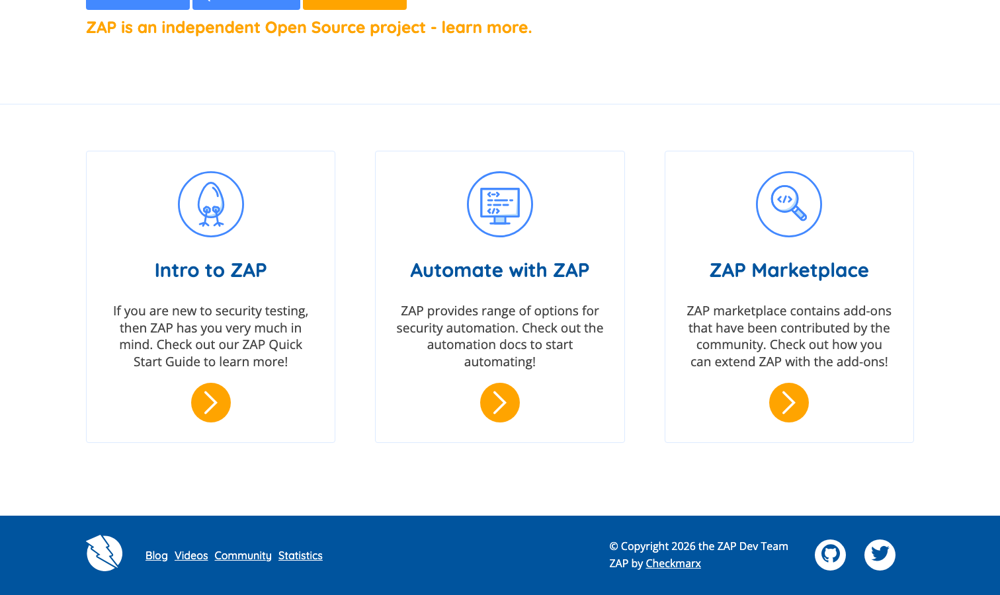

# OWASP ZAP

> 预算有限团队的起步答案。

## 工具简介

OWASP ZAP 是 OWASP 基金会的开源 Web 漏洞扫描器，Burp 最有名的免费平替——主动被动扫描、拦截代理、爬虫、Fuzz 一应俱全，**headless 模式直接进 CI/CD 流水线**，DevSecOps 场景引用量第一。

「ZAP 卡部署」是安全左移的主力打法：流水线里挂 ZAP 扫描，部署完自动过一遍，高危即卡点。预算有限团队的起步答案。

## 基本信息

| 项目 | 信息 |
| --- | --- |
| 出品方 | OWASP 基金会 |
| 工具形态 | Web 漏洞扫描器（Java） |
| 官网 | <https://www.zaproxy.org/> |
| 项目地址 | <https://github.com/zaproxy/zaproxy>（16k+ star） |
| 开源协议 | Apache-2.0 |
| 收费模式 | 开源免费 |

## 收录信息

- 收录自「测试开发技术」公众号文章《2026 年安全测试工具大全，15 款主流工具一次看懂》
- GitHub 数据核验于 2026-10
- [返回安全测试工具清单](./README.md)
