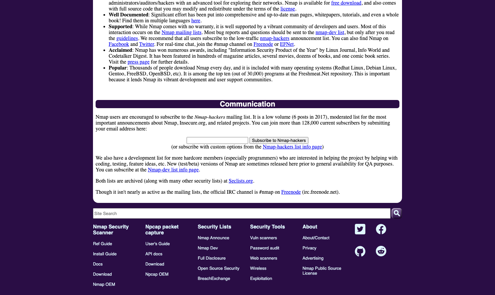

# Nmap

> 所有安全测试的第一步，从它开始画资产地图。

## 工具简介

Nmap 是 1997 年活到现在的网络探测之王——端口扫描、服务指纹、操作系统识别，**NSE 脚本引擎**让它能直接做漏洞检测（内置脚本库覆盖常见 CVE 检测）。

所有安全测试的第一步：从它开始画资产地图，搞清楚「目标有什么」。Kali 的开机默认，二十年常青。

## 基本信息

| 项目 | 信息 |
| --- | --- |
| 出品方 | Nmap（社区） |
| 工具形态 | 网络扫描器（C） |
| 官网 | <https://nmap.org/> |
| 项目地址 | <https://github.com/nmap/nmap>（13k+ star） |
| 开源协议 | Nmap PSF License（开源） |
| 收费模式 | 开源免费 |

## 收录信息

- 收录自「测试开发技术」公众号文章《2026 年安全测试工具大全，15 款主流工具一次看懂》
- GitHub 数据核验于 2026-10
- [返回安全测试工具清单](./README.md)
