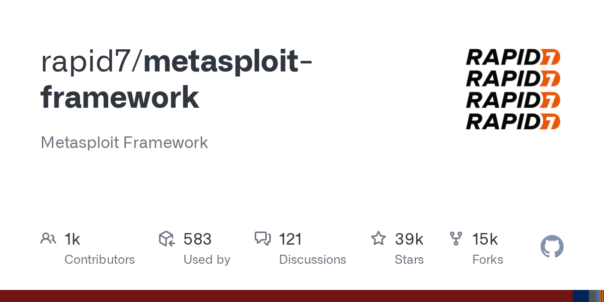

# Metasploit

> 红队演练的军火库底座。

## 工具简介

Metasploit 是 Rapid7 维护的漏洞利用框架——**全球最大的 Payload 库**，从侦察到利用到后渗透一条龙（msfconsole 的模块化工作流）。

学渗透必学它：漏洞的「可利用性验证」（不是扫描器报个高危，是真的打进去证明）靠它完成。授权渗透测试和红队演练的基础设施。

## 基本信息

| 项目 | 信息 |
| --- | --- |
| 出品方 | Rapid7 |
| 工具形态 | 漏洞利用框架（Ruby） |
| 官网 | <https://www.metasploit.com/> |
| 项目地址 | <https://github.com/rapid7/metasploit-framework>（39k+ star） |
| 开源协议 | BSD 系（Framework 版开源） |
| 收费模式 | 开源免费（Metasploit Pro 商业） |

## 收录信息

- 收录自「测试开发技术」公众号文章《2026 年安全测试工具大全，15 款主流工具一次看懂》
- GitHub 数据核验于 2026-10
- [返回安全测试工具清单](./README.md)
