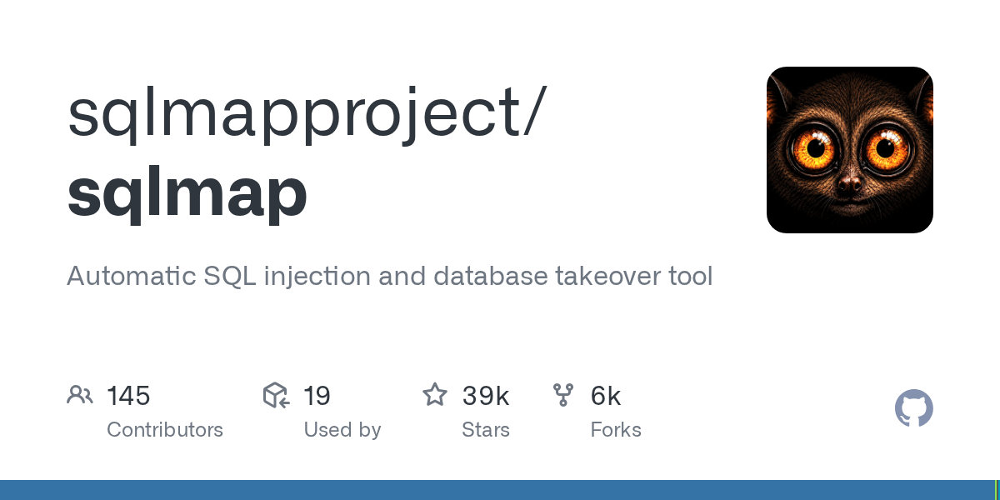

# sqlmap

> 注入口子一旦确认，它比手工快一百倍。

## 工具简介

sqlmap 是 SQL 注入自动化检测与利用的神器——支持几乎所有主流数据库（MySQL、PostgreSQL、Oracle、SQL Server……），从指纹识别到数据提取（拖库）一条龙。

典型工作流：Burp 里手工确认疑似注入点 → sqlmap 接手自动化利用验证。对测试工程师，它也是理解注入危害的最佳教材（授权环境下）。

## 基本信息

| 项目 | 信息 |
| --- | --- |
| 出品方 | sqlmap（社区） |
| 工具形态 | SQL 注入利用工具（Python） |
| 官网 | <https://sqlmap.org/> |
| 项目地址 | <https://github.com/sqlmapproject/sqlmap>（38k+ star） |
| 开源协议 | GPLv2（开源） |
| 收费模式 | 开源免费 |

## 收录信息

- 收录自「测试开发技术」公众号文章《2026 年安全测试工具大全，15 款主流工具一次看懂》
- GitHub 数据核验于 2026-10
- [返回安全测试工具清单](./README.md)
