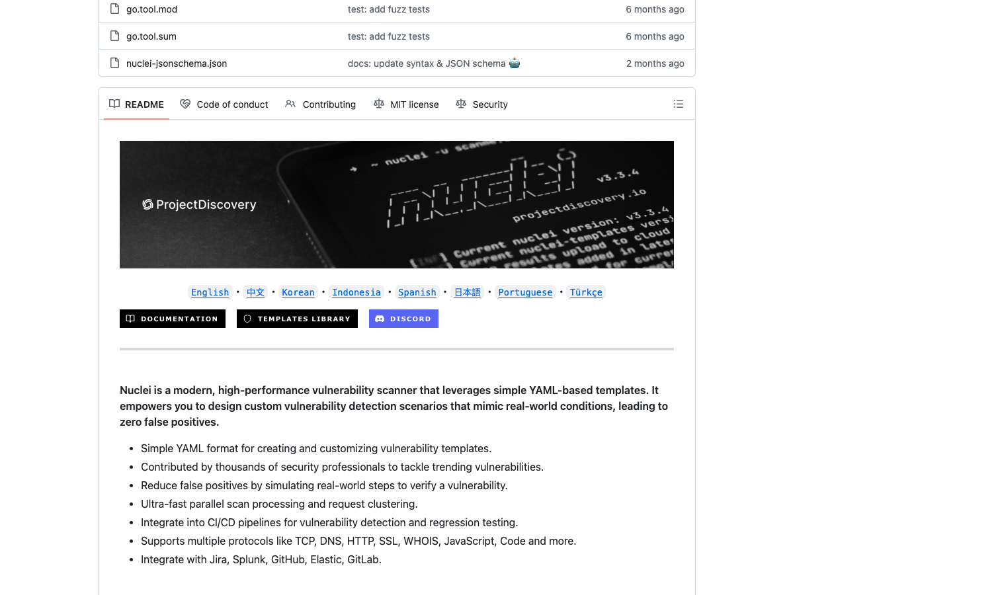

# Nuclei

> 这个赛道最热的明星，模板库成了漏洞情报的半壁江山。

## 工具简介

Nuclei 是 ProjectDiscovery 出品的模板化漏洞扫描器——**YAML 写 PoC 模板，社区模板库上万**，扫描速度快到飞起，被大量安全团队和赏金猎人当作每日情报扫描的主力，DevSecOps 流水线里的常驻嘉宾。

模板库等于全球安全社区在帮你更新武器：每天拿最新模板对资产扫一遍，这个动作本身就是最低成本的安全运营——测开团队把它挂进流水线尤其划算。

## 基本信息

| 项目 | 信息 |
| --- | --- |
| 出品方 | ProjectDiscovery |
| 工具形态 | 模板化漏洞扫描器（Go） |
| 官网 | <https://docs.projectdiscovery.io/tools/nuclei/> |
| 项目地址 | <https://github.com/projectdiscovery/nuclei>（31k+ star） |
| 开源协议 | MIT |
| 收费模式 | 开源免费 |

## 收录信息

- 收录自「测试开发技术」公众号文章《2026 年安全测试工具大全，15 款主流工具一次看懂》
- GitHub 数据核验于 2026-10
- [返回安全测试工具清单](./README.md)
