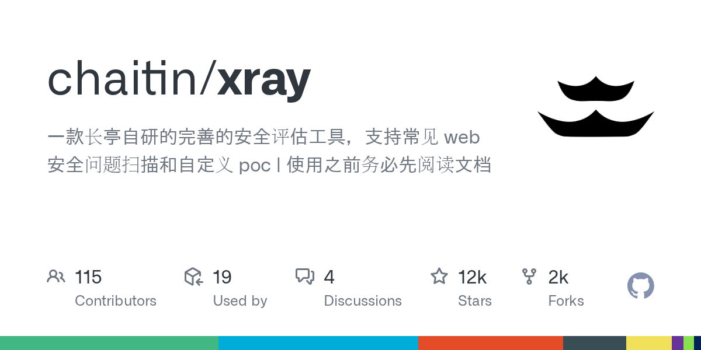

# Xray

> 国产安全圈的口碑产品，被动扫描是招牌。

## 工具简介

Xray 是长亭科技出品的漏洞扫描器，国产安全圈的口碑产品——**被动代理扫描是招牌**：挂在浏览器或 Burp 下游，正常测试的流量过一遍就出洞（不改变测试节奏的前提下持续扫描），和 Burp 联动是国产渗透的常见组合。

社区版免费（内置漏洞类型够用），企业版带更多 PoC 和管理能力。

## 基本信息

| 项目 | 信息 |
| --- | --- |
| 出品方 | 长亭科技 |
| 工具形态 | 漏洞扫描器（被动代理 + 主动扫描） |
| 官网 | <https://github.com/chaitin/xray>（仓库即入口） |
| 项目地址 | <https://github.com/chaitin/xray>（11k+ star） |
| 开源协议 | 社区版免费（非标准开源协议） |
| 收费模式 | 社区版免费 + 企业版商业 |

## 收录信息

- 收录自「测试开发技术」公众号文章《2026 年安全测试工具大全，15 款主流工具一次看懂》
- GitHub 数据核验于 2026-10
- [返回安全测试工具清单](./README.md)
