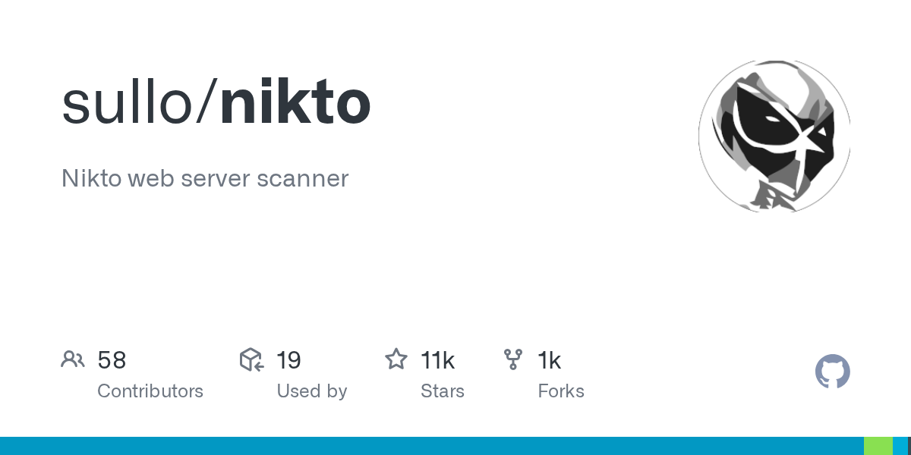

# Nikto

> 虽然吵，但快，资产初筛的敲门砖。

## 工具简介

Nikto 是二十年历史的老牌 Web 服务器扫描器——**危险文件、过期组件、配置问题**（目录列表、默认后台、不安全 header）一遍过。

误报偏多（「吵」），但速度快、覆盖面稳，资产初筛阶段先把明显问题过一遍的敲门砖。和 Nuclei 的分工：Nikto 管配置类问题，Nuclei 管 CVE 情报。

## 基本信息

| 项目 | 信息 |
| --- | --- |
| 出品方 | CIRT（社区） |
| 工具形态 | Web 服务器扫描器（Perl） |
| 官网 | <https://cirt.net/Nikto2> |
| 项目地址 | <https://github.com/sullo/nikto>（10k+ star） |
| 开源协议 | GPL 系（开源） |
| 收费模式 | 开源免费 |

## 收录信息

- 收录自「测试开发技术」公众号文章《2026 年安全测试工具大全，15 款主流工具一次看懂》
- GitHub 数据核验于 2026-10
- [返回安全测试工具清单](./README.md)
