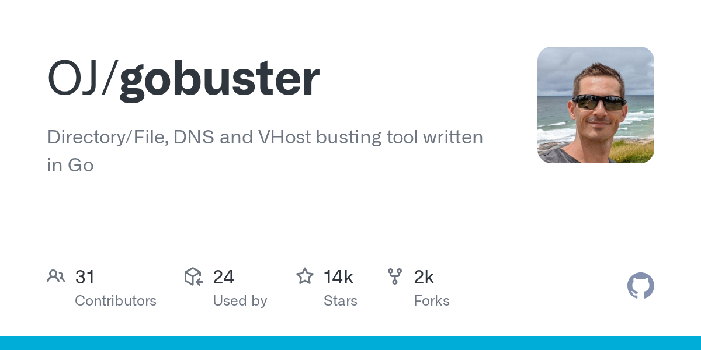

# gobuster

> 目录/DNS/VHost 多模式枚举，Kali 内置。

## 工具简介

gobuster 是 Go 写的高性能暴力枚举工具——**目录/文件、DNS 子域名、VHost 虚拟主机、S3/GCS/TFTP、Fuzzing 多种模式**，多线程可配置并发。

与 ffuf 的分工：ffuf 万物皆可 Fuzz（匹配过滤更灵活），gobuster 的 DNS/VHost/S3 枚举模式是独门能力——子域名收集和云资产枚举场景常见它。

## 基本信息

| 项目 | 信息 |
| --- | --- |
| 出品方 | OJ（社区） |
| 工具形态 | 暴力枚举工具（Go） |
| 官网 | <https://github.com/OJ/gobuster>（仓库即入口） |
| 项目地址 | <https://github.com/OJ/gobuster>（14k+ star） |
| 开源协议 | Apache-2.0 |
| 收费模式 | 开源免费 |

## 收录信息

- 检索补充收录（2026-10），GitHub 数据核验于 2026-10
- [返回安全测试工具清单](./README.md)
