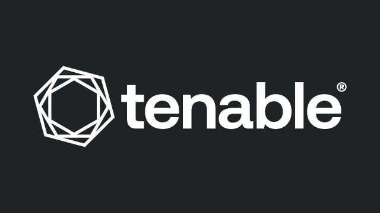

# Nessus

> 主机漏洞扫描老钱，丙方报告和等保测评的常客。

## 工具简介

Nessus 是 Tenable 的主机漏洞扫描老钱——**资产盘点加漏洞识别加合规基线**，插件库覆盖面业内第一（新 CVE 出来基本第一时间有插件），丙方报告和等保测评的常客。

区别于 Web 扫描器（ZAP、AWVS）：Nessus 扫的是主机层（系统补丁、服务版本、弱配置），两者互补组成资产漏洞全景。

## 基本信息

| 项目 | 信息 |
| --- | --- |
| 出品方 | Tenable |
| 工具形态 | 主机漏洞扫描器 |
| 官网 | <https://www.tenable.com/products/nessus> |
| 项目地址 | 闭源 |
| 收费模式 | 家庭版免费 + 专业版订阅 |

## 收录信息

- 收录自「测试开发技术」公众号文章《2026 年安全测试工具大全，15 款主流工具一次看懂》
- [返回安全测试工具清单](./README.md)
