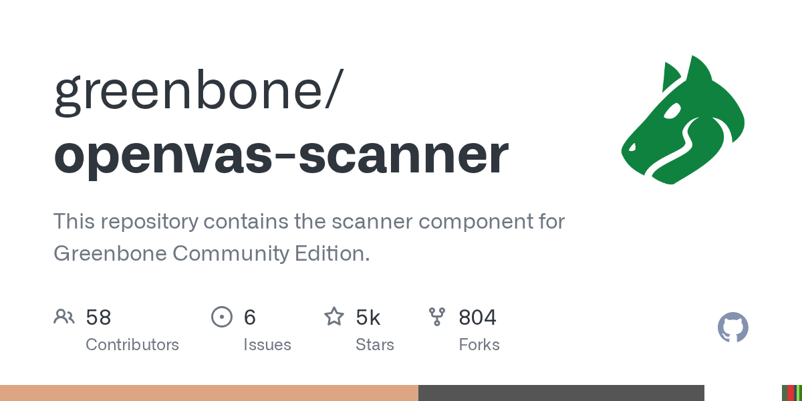

# OpenVAS（Greenbone）

> Nessus 的开源替代，2026 开源安全工具 Top10。

## 工具简介

OpenVAS（Open Vulnerability Assessment Scanner）是 Greenbone 体系的开源漏洞扫描器——Nessus 的开源替代，**主机与服务漏洞扫描的免费方案**，2026 年开源安全工具榜的常客。

功能覆盖与 Nessus 同类（主机层漏洞、配置审计），插件 feed 由 Greenbone 社区维护（商业版 feed 更新更快）。预算有限又需要合规级主机扫描报告的团队用它。

## 基本信息

| 项目 | 信息 |
| --- | --- |
| 出品方 | Greenbone |
| 工具形态 | 漏洞扫描器（开源版） |
| 官网 | <https://www.greenbone.net/> |
| 项目地址 | <https://github.com/greenbone/openvas-scanner>（主扫描器，4.8k+ star） |
| 开源协议 | GPL-2.0 |
| 收费模式 | 开源免费（Greenbone 商业 feed 另售） |

## 收录信息

- 检索补充收录（2026-10），GitHub 数据核验于 2026-10
- [返回安全测试工具清单](./README.md)
