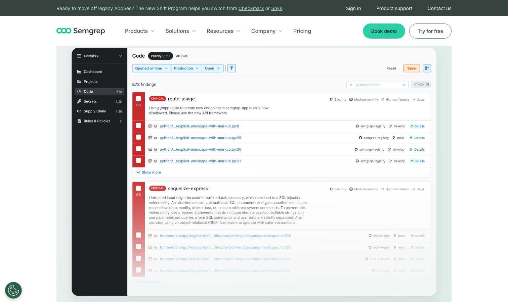

# Semgrep

> SAST 这条线上，它正在重写游戏规则。

## 工具简介

Semgrep 是静态代码分析（SAST）的新贵——**规则即代码**，YAML 写规则（不用写编译器插件），公开规则库覆盖 OWASP Top 10 和主流框架，速度快到能进 CI 卡点（秒级扫全库，不是分钟级）。

对测试团队，安全左移最实际的落点：CI 里挂 Semgrep，提交代码即扫注入、硬编码密钥这类问题，高危卡点。

## 基本信息

| 项目 | 信息 |
| --- | --- |
| 出品方 | Semgrep（公司） |
| 工具形态 | 静态代码分析（SAST） |
| 官网 | <https://semgrep.dev/> |
| 项目地址 | <https://github.com/semgrep/semgrep>（开源引擎） |
| 开源协议 | LGPL（引擎） |
| 收费模式 | 引擎开源免费 + Semgrep App 平台商业 |

## 收录信息

- 收录自「测试开发技术」公众号文章《2026 年安全测试工具大全，15 款主流工具一次看懂》
- [返回安全测试工具清单](./README.md)
