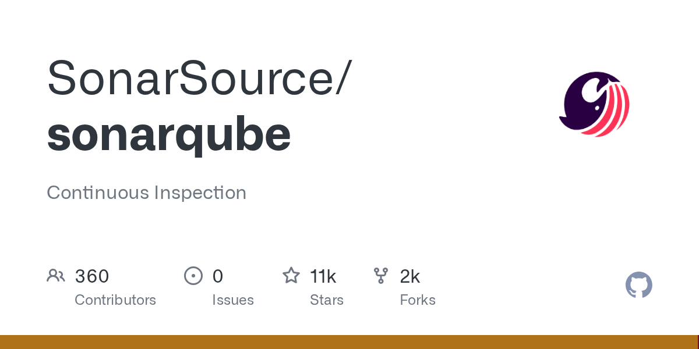

# SonarQube

> 质量门禁（Quality Gate）概念的开创者。

## 工具简介

SonarQube 是代码质量与安全扫描的老牌平台——二十多种语言的静态分析，**质量门禁（Quality Gate）概念的开创者**：代码合不合并由阈值说了算（覆盖率、重复度、漏洞数、坏味道）。

质量视角（可维护性）和安全视角（漏洞、热点）一个平台看全，CI 集成成熟，是「代码质量左移」的基础设施级产品。

## 基本信息

| 项目 | 信息 |
| --- | --- |
| 出品方 | SonarSource |
| 工具形态 | 代码质量与安全平台（自部署/SaaS） |
| 官网 | <https://www.sonarsource.com/products/sonarqube/> |
| 项目地址 | <https://github.com/SonarSource/sonarqube>（11k+ star） |
| 开源协议 | LGPL-3.0（社区版） |
| 收费模式 | 社区版免费 + Developer/Enterprise 订阅 |

## 收录信息

- 检索补充收录（2026-10），GitHub 数据核验于 2026-10
- [返回安全测试工具清单](./README.md)
