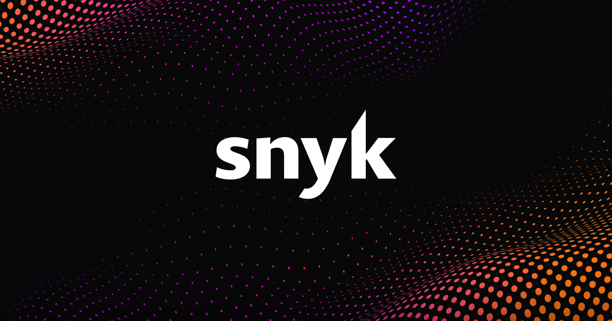

# Snyk

> 开源依赖占比越来越高的今天，它的位置越来越重要。

## 工具简介

Snyk 是供应链安全的代表——**依赖组件漏洞扫描（SCA）起家**，容器镜像和 IaC 也管了，从 IDE 插件到 CI 到运行时一路覆盖。

「Snyk 卡依赖」是安全左移三件套之一：开源依赖占比越来越高的今天，第三方组件的已知漏洞（Log4j 式的雷）靠它持续盯。对开源项目有免费额度。

## 基本信息

| 项目 | 信息 |
| --- | --- |
| 出品方 | Snyk |
| 工具形态 | SCA / 供应链安全平台 |
| 官网 | <https://snyk.io/> |
| 项目地址 | 闭源（CLI 与规则库开源） |
| 收费模式 | 免费层 + 订阅 |

## 收录信息

- 收录自「测试开发技术」公众号文章《2026 年安全测试工具大全，15 款主流工具一次看懂》
- [返回安全测试工具清单](./README.md)
