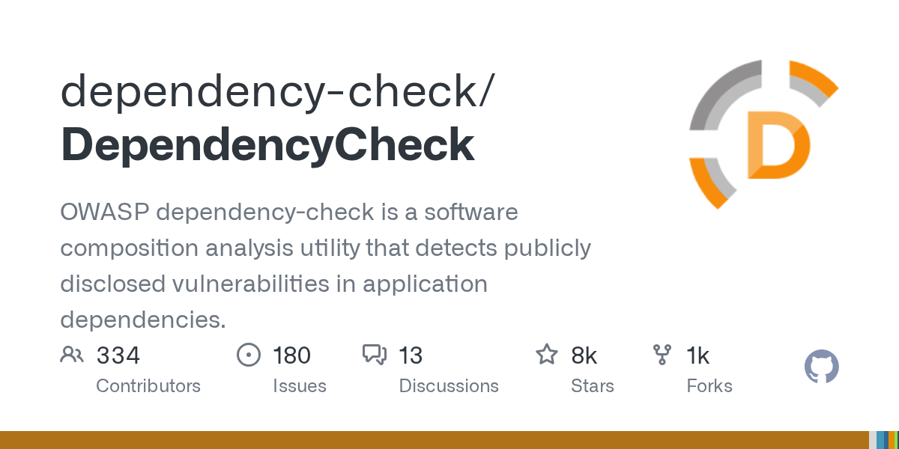

# OWASP Dependency-Check

> SCA 免费方案，OWASP 官方项目。

## 工具简介

OWASP Dependency-Check 是最早的一批 SCA（软件成分分析）工具——扫描项目依赖组件，与 NVD（国家漏洞库）比对，**识别已知漏洞组件**，Maven/Gradle/CLI 多种集成方式。

Snyk 的免费替代：漏洞库更新依赖 NVD 数据（比商业库慢），但零成本 + CI 集成成熟，预算有限团队「卡依赖」的起步方案。

## 基本信息

| 项目 | 信息 |
| --- | --- |
| 出品方 | OWASP |
| 工具形态 | SCA 依赖扫描（Java 为主，多语言支持） |
| 官网 | <https://owasp.org/www-project-dependency-check/> |
| 项目地址 | <https://github.com/dependency-check/DependencyCheck>（7.7k+ star；原 jeremylong 名下已迁移） |
| 开源协议 | Apache-2.0 |
| 收费模式 | 开源免费 |

## 收录信息

- 检索补充收录（2026-10），GitHub 数据核验于 2026-10，仓库按核验结果修正
- [返回安全测试工具清单](./README.md)
