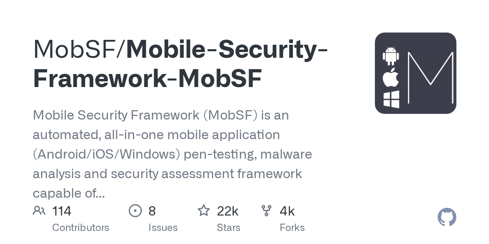

# MobSF

> 移动安全的免费全能选手。

## 工具简介

MobSF（Mobile Security Framework）是一站式移动应用安全测试平台——**静态 + 动态双分析**，APK/IPA 都支持：反编译（JADX/Apktool）、AndroidManifest 解析、硬编码密钥检测、权限与组件导出分析，动态分析加 Frida 脚本联动。

2026 年的移动安全工具对比里，它被评为「唯一免费的全能型工具」——适合做 App 加固与合规检测的广度扫描。业界推荐工作流：**MobSF 做广度，Frida/Objection 做运行时深度验证**（见 [Frida](./23-frida.md)）。

## 基本信息

| 项目 | 信息 |
| --- | --- |
| 出品方 | MobSF（社区） |
| 工具形态 | 移动安全分析平台（Python，Web UI） |
| 官网 | <https://mobsf.github.io/Mobile-Security-Framework-MobSF/> |
| 项目地址 | <https://github.com/MobSF/Mobile-Security-Framework-MobSF>（22k+ star） |
| 开源协议 | GPL-3.0 |
| 收费模式 | 开源免费 |

## 收录信息

- 检索补充收录（2026-10），GitHub 数据核验于 2026-10
- [返回安全测试工具清单](./README.md)
