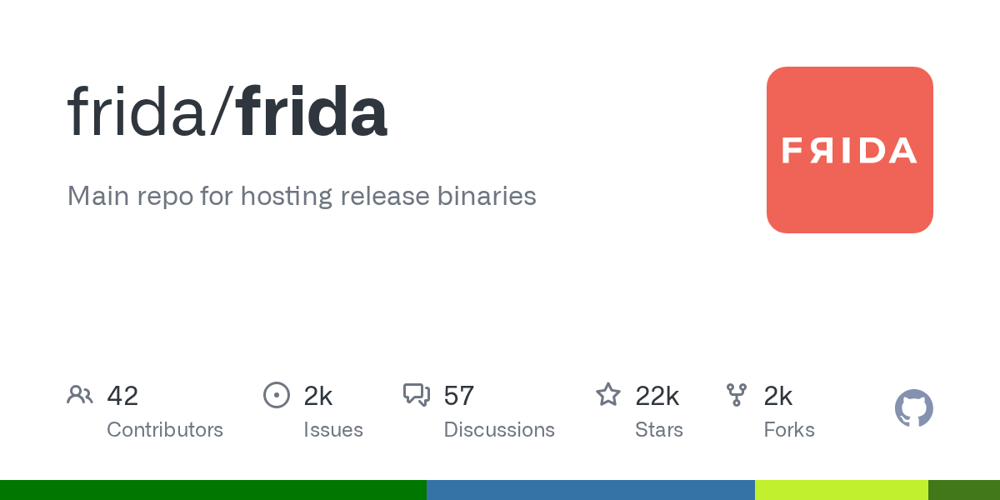

# Frida

> 动态插桩的事实标准，安全研究员的瑞士军刀。

## 工具简介

Frida 是动态插桩框架——往运行中的进程注入 JavaScript 引擎，**Hook 任意函数**（改参数、改返回值、追踪调用）、绕过 SSL Pinning、绕过 root 检测，做运行时的安全假设验证。

移动 App 安全测试的标配：抓包被证书锁定挡住时、加密参数看不懂时、加固检测绕不过时，Frida + Objection（基于它的工具箱）是解题钥匙。配合 MobSF 的「广度 + 深度」组合是业界推荐工作流。

## 基本信息

| 项目 | 信息 |
| --- | --- |
| 出品方 | Frida（社区） |
| 工具形态 | 动态插桩框架（C + JS） |
| 官网 | <https://frida.re/> |
| 项目地址 | <https://github.com/frida/frida>（22k+ star） |
| 开源协议 | 开源（mixed，核心免费） |
| 收费模式 | 开源免费 |

## 收录信息

- 检索补充收录（2026-10），GitHub 数据核验于 2026-10
- [返回安全测试工具清单](./README.md)
