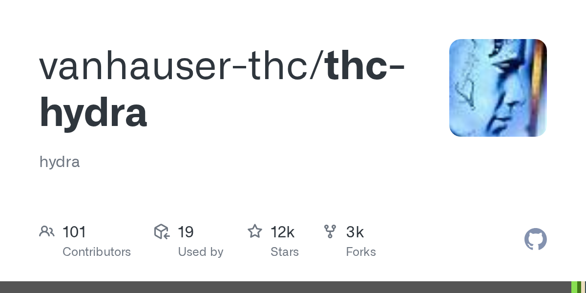

# Hydra

> 弱口令暴破经典，数十种协议。

## 工具简介

Hydra（THC-Hydra）是弱口令暴破的经典工具——**数十种协议**的并行登录爆破（SSH、FTP、HTTP 表单、RDP、SMB、MySQL、Redis……），支持字典和组合规则，分布式多目标。

安全测评里「弱口令排查」这一项的实际验证工具：拿授权资产清单 + 常用口令字典跑一遍，比人工抽查可信。十年常青，Kali 内置。

## 基本信息

| 项目 | 信息 |
| --- | --- |
| 出品方 | THC（The Hacker's Choice） |
| 工具形态 | 并行登录爆破工具（C） |
| 官网 | <https://github.com/vanhauser-thc/thc-hydra>（仓库即入口） |
| 项目地址 | <https://github.com/vanhauser-thc/thc-hydra>（12k+ star） |
| 开源协议 | AGPL-3.0（商用集成需评估） |
| 收费模式 | 开源免费 |

## 收录信息

- 检索补充收录（2026-10），GitHub 数据核验于 2026-10
- [返回安全测试工具清单](./README.md)
