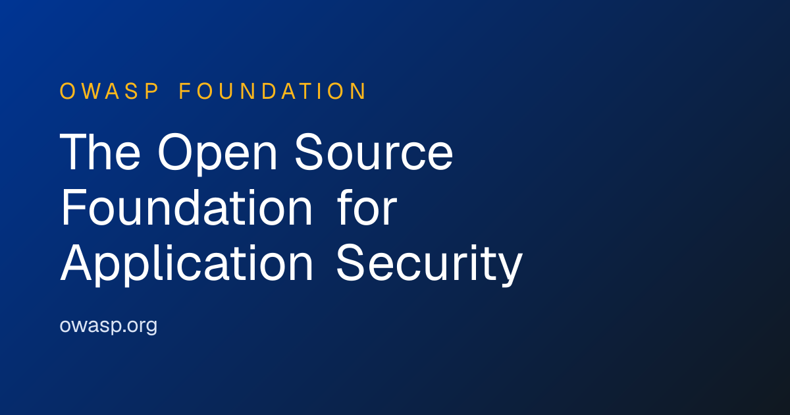

# Amass

> 子域名收集与攻击面测绘的事实标准。

## 工具简介

Amass 是 OWASP 旗下的开源攻击面测绘（ASM）工具——**子域名枚举、DNS 映射、证书透明度、外部数据源聚合**（API 集成数十个情报源），信息收集阶段的主力。

渗透测试的第一步是「目标到底有多少资产」——域名、子域、解析记录，Amass 把散落各处的信号聚合成一张攻击面地图，与 Nmap（网络层）、gobuster（目录层）接力。

## 基本信息

| 项目 | 信息 |
| --- | --- |
| 出品方 | OWASP（社区） |
| 工具形态 | 攻击面测绘工具（Go） |
| 官网 | <https://owasp.org/www-project-amass/> |
| 项目地址 | <https://github.com/owasp-amass/amass>（15k+ star） |
| 开源协议 | Apache-2.0 |
| 收费模式 | 开源免费 |

## 收录信息

- 检索补充收录（2026-10），GitHub 数据核验于 2026-10
- [返回安全测试工具清单](./README.md)
