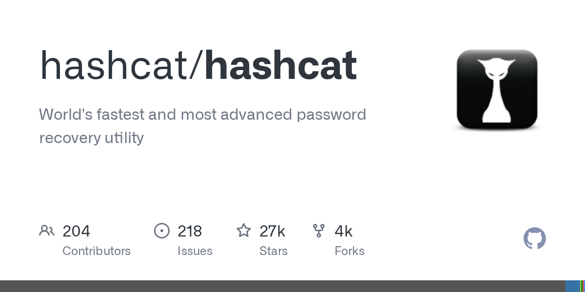

# hashcat

> GPU 密码破解之王。

## 工具简介

hashcat 是 GPU 密码破解之王——**上百种哈希算法**（MD5、bcrypt、NTLM、Wi-Fi 握手包……），多 GPU 并行，规则引擎把字典变换组合出天文数字的候选。

授权场景两大用途：密码强度审计（抽一批用户哈希跑常见规则，看多久能破——破得越快说明口令策略越弱）和 Wi-Fi 握手包恢复。CPU 版替代是 John the Ripper。

## 基本信息

| 项目 | 信息 |
| --- | --- |
| 出品方 | hashcat（社区） |
| 工具形态 | 密码恢复工具（C，GPU） |
| 官网 | <https://hashcat.net/hashcat/> |
| 项目地址 | <https://github.com/hashcat/hashcat>（27k+ star） |
| 开源协议 | 开源（MIT 系） |
| 收费模式 | 开源免费 |

## 收录信息

- 检索补充收录（2026-10），GitHub 数据核验于 2026-10
- [返回安全测试工具清单](./README.md)
