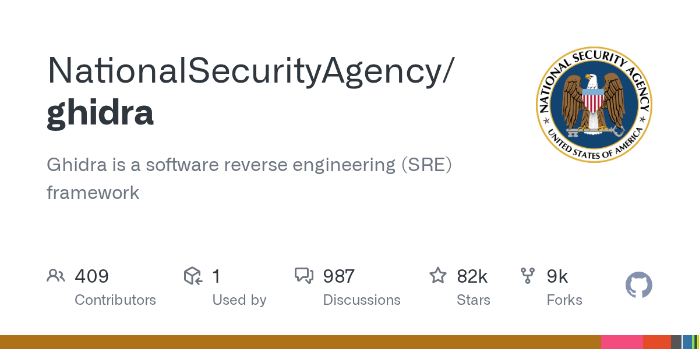

# Ghidra

> NSA 开源，IDA 的免费替代。

## 工具简介

Ghidra 是 NSA 开源的逆向工程套件——**反编译器（多架构）加全套分析工具**（函数识别、交叉引用、脚本扩展），2019 年开源即轰动，商用逆向工具 IDA 的免费替代。

漏洞挖掘与恶意代码分析的底座：二进制层的漏洞研究（闭源组件、固件）、CTF 的 reverse 题型、病毒分析都靠它。测试工程师接触它多在「黑盒测不了、只能看二进制」的极端场景。

## 基本信息

| 项目 | 信息 |
| --- | --- |
| 出品方 | 美国国家安全局（NSA） |
| 工具形态 | 逆向工程套件（Java，跨平台） |
| 官网 | <https://ghidra-sre.org/> |
| 项目地址 | <https://github.com/NationalSecurityAgency/ghidra>（81k+ star） |
| 开源协议 | Apache-2.0 |
| 收费模式 | 开源免费 |

## 收录信息

- 检索补充收录（2026-10），GitHub 数据核验于 2026-10（仓库为 NationalSecurityAgency/ghidra）
- [返回安全测试工具清单](./README.md)
