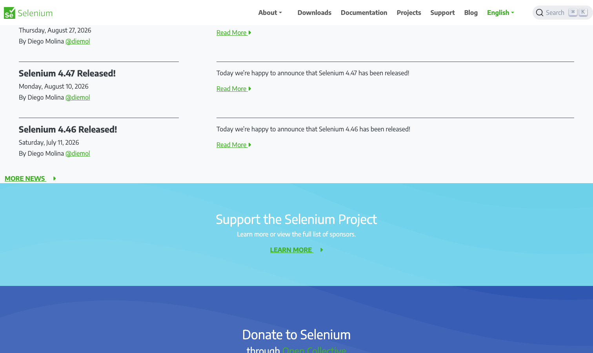

# Selenium

> 老祖师，W3C WebDriver 标准就是从它来的。

## 工具简介

Selenium 是 2004 年出道的 Web UI 自动化老祖师，W3C WebDriver 标准就是从它来的——浏览器兼容性之王，语言绑定最全（Java、Python、C#、Ruby 都是一等公民），生态资料浩如烟海。

虽然新一代工具在速度和稳定性上全面超越，但遗留系统和超广兼容需求场景，它依然是答案：配合 Grid 能把用例分发到几十台机器、几十种浏览器版本上并行跑，浏览器兼容测试是它的主场。Selenium 4 之后也补了双向协议和相对定位器，老树发新芽。

## 基本信息

| 项目 | 信息 |
| --- | --- |
| 适用端 | Web |
| 出品方 | Selenium / 社区 |
| 工具形态 | 自动化框架（多语言绑定） |
| 官网 | <https://www.selenium.dev/> |
| 项目地址 | <https://github.com/SeleniumHQ/selenium>（34k+ star） |
| 开源协议 | Apache-2.0 |
| 收费模式 | 开源免费 |

## 收录信息

- 收录自「测试开发技术」公众号文章《2026 年 UI 自动化工具大全，20 款主流工具一次看懂》《Web 自动化测试全景图：20 个主流 AI 自动化工具如何选？》（两篇均收录）
- GitHub 数据核验于 2026-10
- [返回 UI 自动化工具清单](./README.md)
