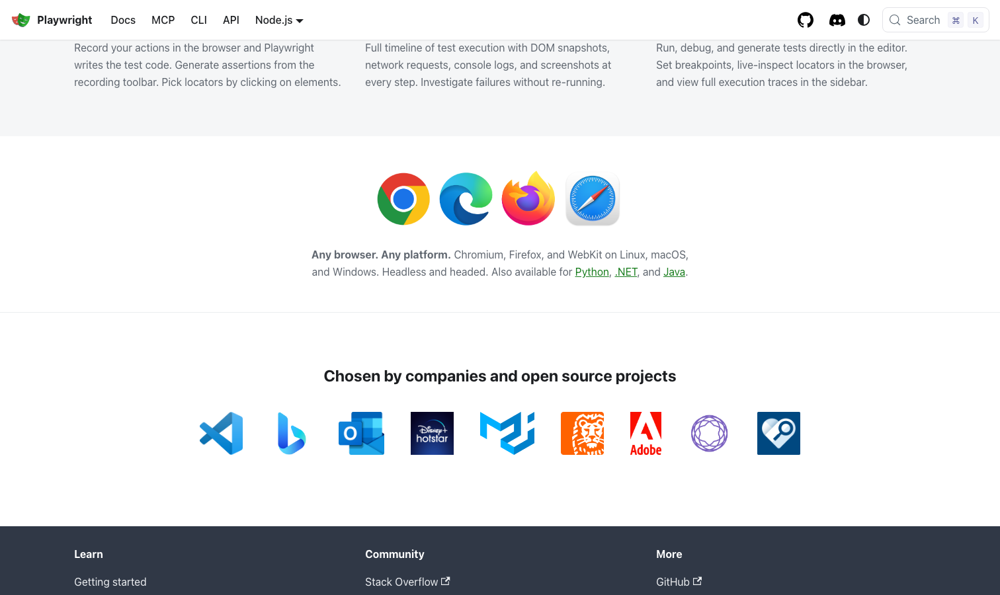

# Playwright

> 新项目不知道选什么，选它基本不会错。

## 工具简介

Playwright 是微软出品的 Web UI 自动化框架，现在的增长冠军——Chromium、Firefox、WebKit 三引擎原生驱动，自动等待写进基因，codegen 录制、trace viewer 排错、并行测试开箱即用。

2026 年最值得注意的是官方定位：**测试、脚本、AI 代理三类场景一等公民**——Playwright 已经不是单一框架，是一套工具集（Library / Test / MCP / CLI / VS Code 扩展），Agent 工具链大量集成，浏览器自动化的事实底座。它的 API 测试能力见[接口测试工具分类](../api-testing-tools/15-playwright-api.md)。

## 基本信息

| 项目 | 信息 |
| --- | --- |
| 适用端 | Web |
| 出品方 | 微软 |
| 工具形态 | 自动化框架 + 工具集（Library / Test / MCP / CLI / IDE 扩展） |
| 官网 | <https://playwright.dev/> |
| 项目地址 | <https://github.com/microsoft/playwright>（97k+ star） |
| 开源协议 | Apache-2.0 |
| 收费模式 | 开源免费 |

## 收录信息

- 收录自「测试开发技术」公众号文章《2026 年 UI 自动化工具大全，20 款主流工具一次看懂》《Web 自动化测试全景图：20 个主流 AI 自动化工具如何选？》（两篇均收录）
- GitHub 数据核验于 2026-10
- [返回 UI 自动化工具清单](./README.md)
