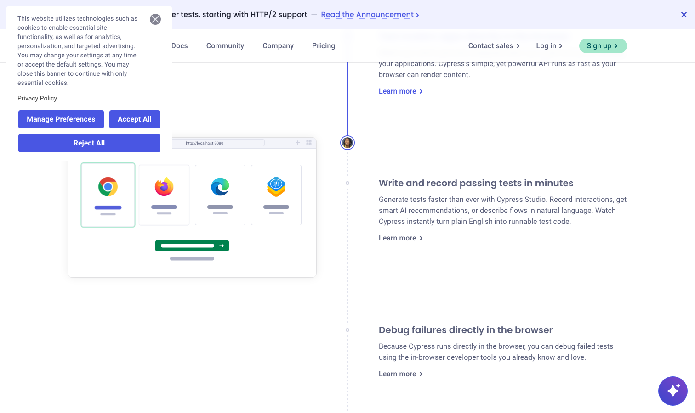

# Cypress

> 前端团队的心头好，开发写测试的体验无敌。

## 工具简介

Cypress 架构上直接跑在浏览器里，时间旅行调试（报错时每个时间点的页面快照都能回放）、实时重载（代码一保存测试自动重跑），前端工程师写它最顺手，SPA 项目里粉丝众多。

短板也一直没解决：跨域访问和多标签页是软肋，多标签多域名场景经常撞墙。适合前端主导的工程，不适合测试团队做全域覆盖。

## 基本信息

| 项目 | 信息 |
| --- | --- |
| 适用端 | Web |
| 出品方 | Cypress.io |
| 工具形态 | 测试框架（浏览器内执行） |
| 官网 | <https://cypress.io/> |
| 项目地址 | <https://github.com/cypress-io/cypress>（51k+ star） |
| 开源协议 | MIT |
| 收费模式 | 开源免费（Cypress Cloud 商业） |

## 收录信息

- 收录自「测试开发技术」公众号文章《2026 年 UI 自动化工具大全，20 款主流工具一次看懂》《Web 自动化测试全景图：20 个主流 AI 自动化工具如何选？》（两篇均收录）
- GitHub 数据核验于 2026-10
- [返回 UI 自动化工具清单](./README.md)
