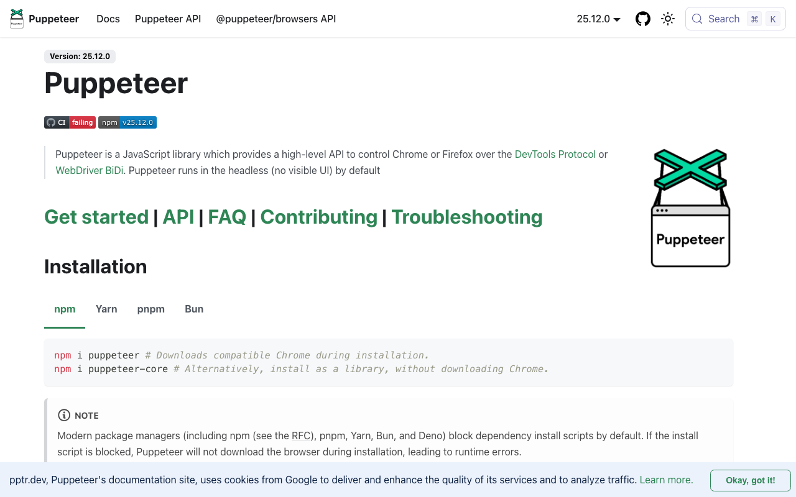

# Puppeteer

> 测试只是它的副业，但副业也够强。

## 工具简介

Puppeteer 是 Google Chrome DevTools 团队官方出品，最早把 CDP 底层协议用起来的就是它——DevTools 里能干的事它基本都能干，性能采集、请求拦截都是现成 API。

强项在轻和快：一个浏览器实例能开几十上百个页面，内存占用小，无头模式塞进服务器定时任务很自然。爬虫、网页截图、生成 PDF 这些活用它最多，轻量测试场景直接用它比上框架省事。

## 基本信息

| 项目 | 信息 |
| --- | --- |
| 适用端 | Web |
| 出品方 | Google（Chrome DevTools 团队） |
| 工具形态 | Node.js 自动化库 |
| 官网 | <https://pptr.dev/> |
| 项目地址 | <https://github.com/puppeteer/puppeteer>（95k+ star） |
| 开源协议 | Apache-2.0 |
| 收费模式 | 开源免费 |

## 收录信息

- 收录自「测试开发技术」公众号文章《2026 年 UI 自动化工具大全，20 款主流工具一次看懂》《Web 自动化测试全景图：20 个主流 AI 自动化工具如何选？》（两篇均收录）
- GitHub 数据核验于 2026-10
- [返回 UI 自动化工具清单](./README.md)
