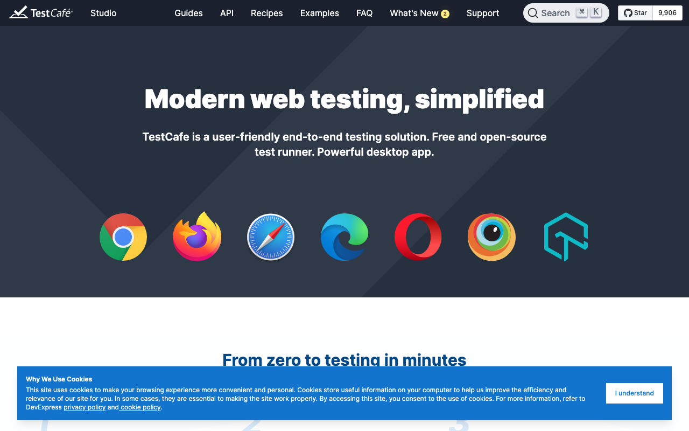

# TestCafe

> 不用装任何浏览器驱动，环境配置全省。

## 工具简介

TestCafe 是 DevExpress 出品的 Web 测试框架，不依赖 WebDriver、自带浏览器驱动——任意浏览器、远程机器、手机真机浏览器都能直接跑。

免驱动还有一层好处：同一个用例，本地 Chrome、远程 Linux、手机浏览器跑的都是同一份脚本，环境之间不用各配一遍。一条命令还能同时开几个浏览器并发跑同一批用例，跨浏览器回归一次完成，怕折腾环境的人会喜欢它。

## 基本信息

| 项目 | 信息 |
| --- | --- |
| 适用端 | Web（含移动浏览器） |
| 出品方 | DevExpress |
| 工具形态 | 测试框架（自带驱动） |
| 官网 | <https://testcafe.io/> |
| 项目地址 | <https://github.com/DevExpress/testcafe>（9.8k+ star） |
| 开源协议 | MIT |
| 收费模式 | 开源免费（并发执行也免费） |

## 收录信息

- 收录自「测试开发技术」公众号文章《2026 年 UI 自动化工具大全，20 款主流工具一次看懂》《Web 自动化测试全景图：20 个主流 AI 自动化工具如何选？》（两篇均收录）
- GitHub 数据核验于 2026-10
- [返回 UI 自动化工具清单](./README.md)
