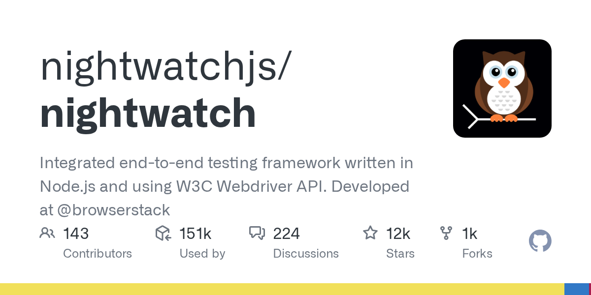

# Nightwatch.js

> Node 系老牌，低调耐用。

## 工具简介

Nightwatch.js 是 Node 系老牌 Web 测试框架，API 简洁，断言内建，WebDriver 协议原生——Angular 和 Vue 社区里常见它的身影。

没有花哨的概念，胜在稳定耐用，Node 技术栈团队想要一个「装上就能用」的端到端框架，它是低調可靠的选择。

## 基本信息

| 项目 | 信息 |
| --- | --- |
| 适用端 | Web |
| 出品方 | Nightwatch（社区） |
| 工具形态 | Node.js 测试框架 |
| 官网 | <https://nightwatchjs.org/> |
| 项目地址 | <https://github.com/nightwatchjs/nightwatch>（12k+ star） |
| 开源协议 | MIT |
| 收费模式 | 开源免费（Nightwatch Cloud 商业） |

## 收录信息

- 收录自「测试开发技术」公众号文章《2026 年 UI 自动化工具大全，20 款主流工具一次看懂》
- GitHub 数据核验于 2026-10
- [返回 UI 自动化工具清单](./README.md)
