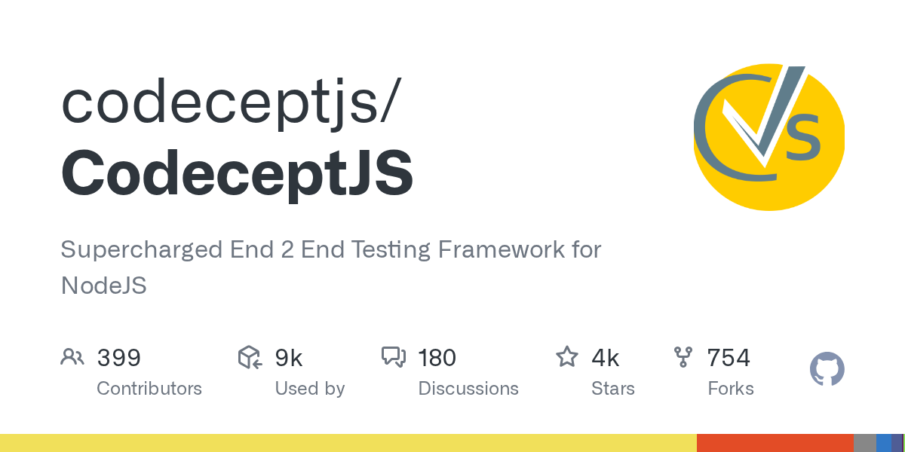

# CodeceptJS

> 用例像剧本一样写：我打开页面，我点击按钮，我看见结果。

## 工具简介

CodeceptJS 是场景驱动的 Web 测试框架，用例像剧本一样写——「我打开页面，我点击按钮，我看见结果」，背后可以挂 WebDriver、Playwright、Puppeteer 当执行后端。

抽象层设计得很优雅：**想换底层引擎不用重写用例**，执行层升级（比如从 WebDriver 换 Playwright）时代码资产保得住。

## 基本信息

| 项目 | 信息 |
| --- | --- |
| 适用端 | Web（可挂 Appium 扩展到移动端） |
| 出品方 | CodeceptJS（社区） |
| 工具形态 | 场景驱动测试框架（Node.js） |
| 官网 | <https://codecept.io/> |
| 项目地址 | <https://github.com/codeceptjs/CodeceptJS>（4.2k+ star） |
| 开源协议 | MIT |
| 收费模式 | 开源免费 |

## 收录信息

- 收录自「测试开发技术」公众号文章《2026 年 UI 自动化工具大全，20 款主流工具一次看懂》
- GitHub 数据核验于 2026-10
- [返回 UI 自动化工具清单](./README.md)
