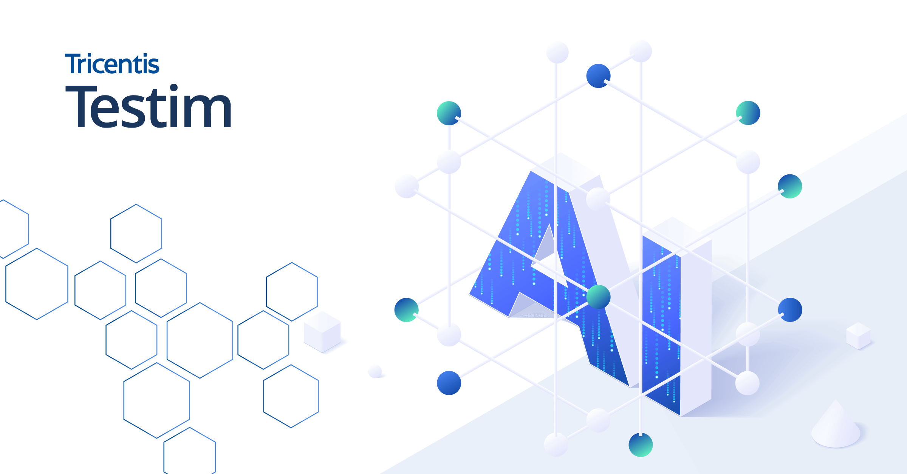

# Testim

> AI 定位器的鼻祖，维护成本砍掉一大截。

## 工具简介

Testim 是 AI 定位器的鼻祖，被 Tricentis 收购后整合进企业级测试体系。它的思路是**每个定位器动态评估稳定性**——页面改版后自动换更可靠的选择器，维护成本砍掉一大截。

对「用例写出来三个月就维护不动」的团队，这类 AI 自愈平台是对症的药。

## 基本信息

| 项目 | 信息 |
| --- | --- |
| 适用端 | Web |
| 出品方 | Testim（Tricentis） |
| 工具形态 | AI 自愈测试平台 |
| 官网 | <https://www.testim.io/> |
| 项目地址 | 闭源 |
| 收费模式 | 订阅 |

## 收录信息

- 收录自「测试开发技术」公众号文章《2026 年 UI 自动化工具大全，20 款主流工具一次看懂》
- [返回 UI 自动化工具清单](./README.md)
