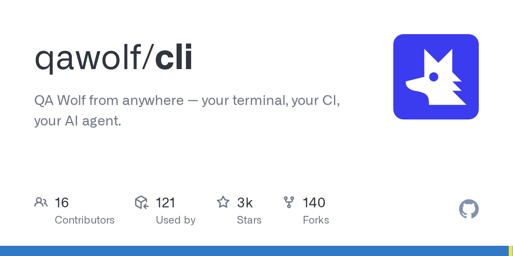

# QA Wolf

> 想要 E2E 覆盖但没有人力养用例的团队，看它。

## 工具简介

QA Wolf 是 AI 加人工混合交付的 E2E 测试服务——自然语言描述场景，它产出并维护 Playwright 用例，开源路线（CLI 开源）。

对想要 E2E 覆盖但团队没有人力养用例的公司，这是「测试即服务」的路子：用例的产出和维护外包给它的流水线，团队只管提场景和验收。

## 基本信息

| 项目 | 信息 |
| --- | --- |
| 适用端 | Web |
| 出品方 | QA Wolf |
| 工具形态 | E2E 测试服务 + 开源 CLI |
| 官网 | <https://www.qawolf.com/> |
| 项目地址 | <https://github.com/qawolf/cli>（3.4k+ star；原 `qawolf/qawolf` 已迁移） |
| 开源协议 | Apache-2.0（CLI） |
| 收费模式 | CLI 开源免费，托管服务订阅 |

## 收录信息

- 收录自「测试开发技术」公众号文章《2026 年 UI 自动化工具大全，20 款主流工具一次看懂》
- GitHub 数据核验于 2026-10，仓库按核验结果修正为 `qawolf/cli`
- [返回 UI 自动化工具清单](./README.md)
