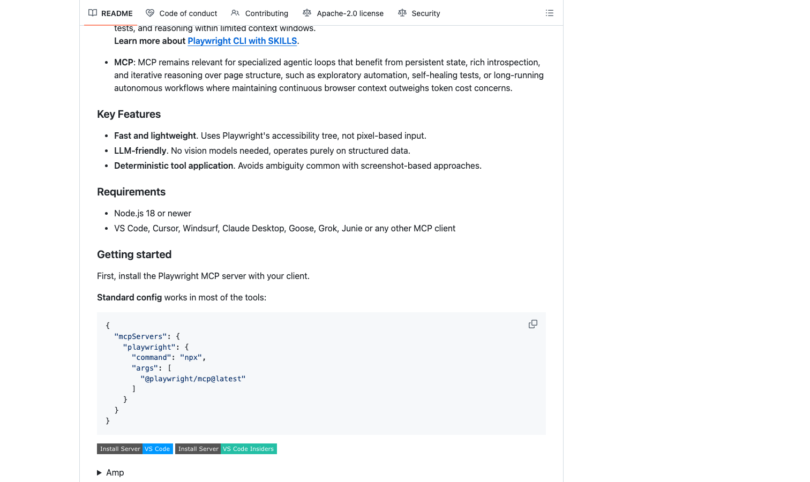

# Playwright MCP

> 不是截图靠猜，是读页面结构干活。

## 工具简介

Playwright MCP 是微软官方的 MCP 服务器，让 AI Agent 通过**结构化的无障碍树**驱动浏览器——元素有角色有名字，点哪个填哪个说得清，比截图方案快、省 token、误操作少。

2026 年 Agent 驱动测试的主流通道，Cursor、Claude 这类对话式客户端即插即用，探索页面、调试流程、批量改数据这类活最合适。与 [Playwright CLI](./12-playwright-cli.md) 的取舍：随手用、要人机来回确认选 MCP；长任务、固定流程、token 预算紧选 CLI。

## 基本信息

| 项目 | 信息 |
| --- | --- |
| 适用端 | Web |
| 出品方 | 微软 |
| 工具形态 | MCP 服务器（Agent 工具） |
| 官网 | <https://playwright.dev/mcp/introduction> |
| 项目地址 | <https://github.com/microsoft/playwright-mcp>（37k+ star） |
| 开源协议 | Apache-2.0 |
| 收费模式 | 开源免费 |

## 收录信息

- 收录自「测试开发技术」公众号文章《2026 年 UI 自动化工具大全，20 款主流工具一次看懂》《Web 自动化测试全景图：20 个主流 AI 自动化工具如何选？》（两篇均收录）
- GitHub 数据核验于 2026-10
- [返回 UI 自动化工具清单](./README.md)
