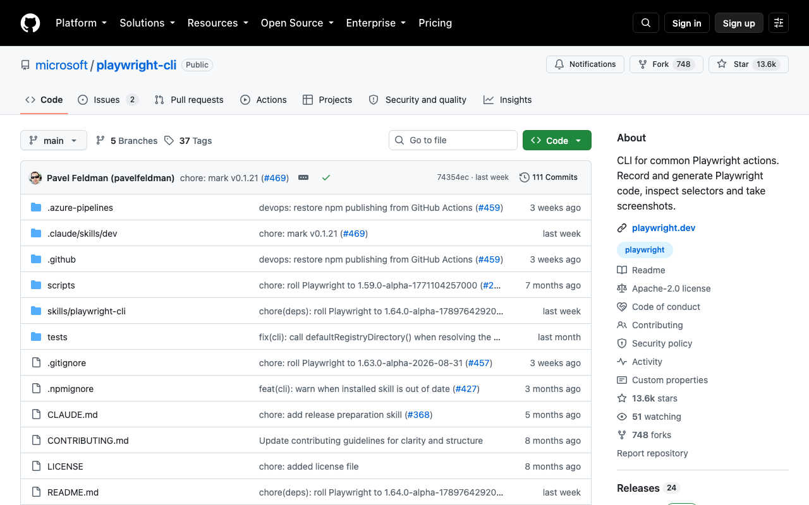

# Playwright CLI

> MCP 烧 token，CLI 直接走命令行调用，同样的活花得更少。

## 工具简介

Playwright CLI 是微软新发的命令行工具，官方定位说得很清楚：MCP 要往上下文里塞工具清单和无障碍树，太烧 token；CLI 模式直接走命令行调用，常用操作（开页面、点按钮、填表单、读内容）都做成了短命令，agent 一步一步调，每步只带回需要的结果。

重度 agent 用户和长任务最适合——写进 Claude Code、Codex 这类终端 agent 的日常工作流，任务越长、批量越大，与 MCP 的 token 差距越明显。

## 基本信息

| 项目 | 信息 |
| --- | --- |
| 适用端 | Web |
| 出品方 | 微软 |
| 工具形态 | 命令行工具（Agent 工具） |
| 官网 | <https://github.com/microsoft/playwright-cli>（仓库即入口） |
| 项目地址 | <https://github.com/microsoft/playwright-cli>（13k+ star） |
| 开源协议 | Apache-2.0 |
| 收费模式 | 开源免费 |

## 收录信息

- 收录自「测试开发技术」公众号文章《Web 自动化测试全景图：20 个主流 AI 自动化工具如何选？》
- GitHub 数据核验于 2026-10
- [返回 UI 自动化工具清单](./README.md)
