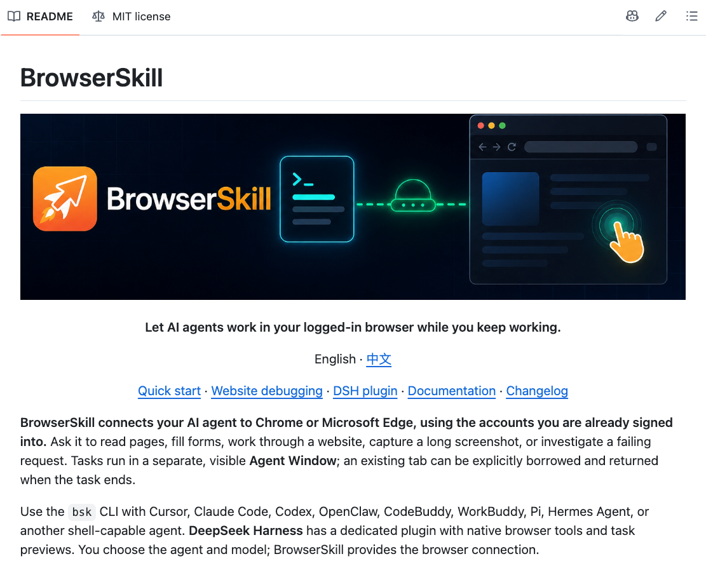

# BrowserSkill（腾讯）

> 登录态、cookie 全都现成，人登录过的系统它抬手就进。

## 工具简介

BrowserSkill 是腾讯 2026 年 6 月开源的 Agent 浏览器工具，三个月冲到七千多 star。它解决的就是**登录这道坎**——Agent 不用再开一个干净的无头浏览器去硬闯扫码和滑块，而是直接借用你日常在用的 Chrome，登录态、cookie 全都现成。

思路是把最难的部分交还给人：验证码、扫码、风控这些 agent 搞不定的环节，你自己登录一遍，剩下的交给它。公众号后台、企业内网这些没有开放 API 的地方特别合适。

## 基本信息

| 项目 | 信息 |
| --- | --- |
| 适用端 | Web（借用日常浏览器的登录态） |
| 出品方 | 腾讯 |
| 工具形态 | Agent 浏览器工具（CLI / Skill） |
| 官网 | <https://github.com/Tencent/BrowserSkill>（仓库即入口） |
| 项目地址 | <https://github.com/Tencent/BrowserSkill>（8.4k+ star） |
| 开源协议 | MIT |
| 收费模式 | 开源免费 |

## 收录信息

- 收录自「测试开发技术」公众号文章《Web 自动化测试全景图：20 个主流 AI 自动化工具如何选？》
- GitHub 数据核验于 2026-10
- [返回 UI 自动化工具清单](./README.md)
