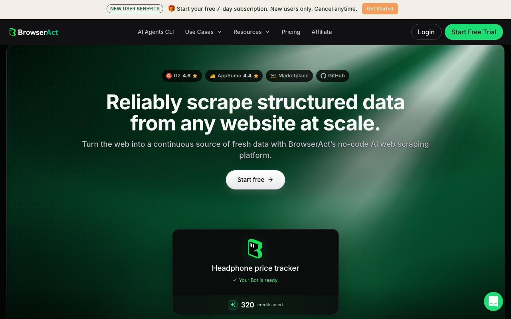

# BrowserAct

> 专攻反爬封锁这一段，总被风控纠缠的团队重点看它。

## 工具简介

BrowserAct 专攻反爬封锁——突破验证码和风控只是基础，细节做得比较全：任务卡住可以**暂停转人工**，人处理完接着跑，长任务不用人盯着；多任务并行、多账号会话隔离，采集和批量操作的重活扛得住，还提供 n8n 工作流组件接进现有自动化流程。

CLI 是商业产品，配套 Skill 仓库开源（2026 年 2 月建仓，七个月 6 千 star）。

## 基本信息

| 项目 | 信息 |
| --- | --- |
| 适用端 | Web（风控/验证码场景） |
| 出品方 | BrowserAct |
| 工具形态 | 浏览器 Agent（CLI + Skill） |
| 官网 | <https://browseract.com> |
| 项目地址 | <https://github.com/browser-act/skills>（6.1k+ star，Skill 仓库） |
| 开源协议 | MIT（Skill 仓库；CLI 商业） |
| 收费模式 | CLI 商业订阅 + Skill 开源 |

## 收录信息

- 收录自「测试开发技术」公众号文章《Web 自动化测试全景图：20 个主流 AI 自动化工具如何选？》
- GitHub 数据核验于 2026-10
- [返回 UI 自动化工具清单](./README.md)
