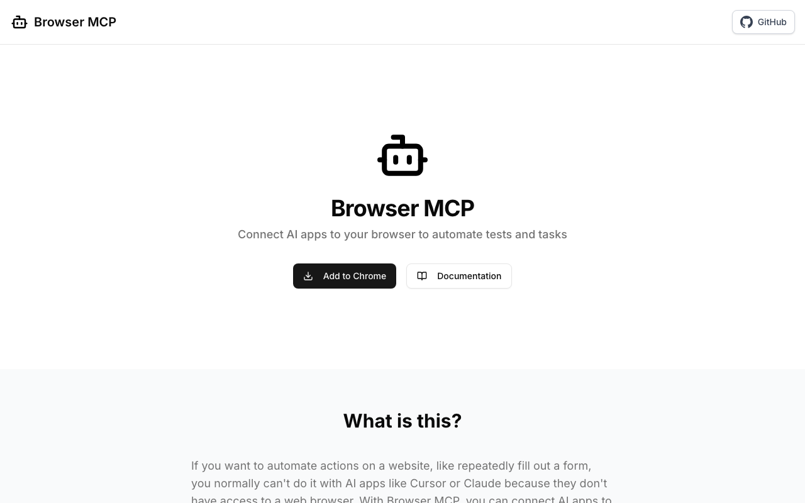

# Browser MCP

> 从安装到能用不超过十分钟。

## 工具简介

Browser MCP 是这批工具里门槛最低的一个——Chrome 装个扩展就能用，操作的就是你日常那个浏览器，书签、登录态全在。从安装到能用不超过十分钟。

深度能力别指望，但想先体验一下 agent 开浏览器、再决定要不要上重型方案，它是最合适的起点。注意：**2025 年 4 月后项目没再更新**，选型时把这个因素考虑进去。

## 基本信息

| 项目 | 信息 |
| --- | --- |
| 适用端 | Web |
| 出品方 | Browser MCP（社区） |
| 工具形态 | Chrome 扩展 + MCP |
| 官网 | <https://browsermcp.io> |
| 项目地址 | <https://github.com/BrowserMCP/mcp>（7.1k+ star） |
| 开源协议 | Apache-2.0 |
| 收费模式 | 开源免费（2025-04 后停更） |

## 收录信息

- 收录自「测试开发技术」公众号文章《Web 自动化测试全景图：20 个主流 AI 自动化工具如何选？》
- GitHub 数据核验于 2026-10
- [返回 UI 自动化工具清单](./README.md)
