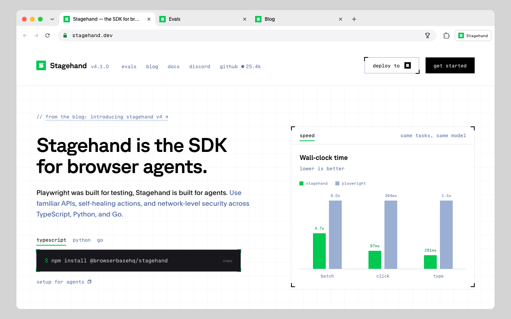

# Stagehand（Browserbase）

> AI 的灵活和工程的稳定可以一起要。

## 工具简介

Stagehand 在 Playwright 之上加了一层自然语言接口，把 agent 能力做成 **act、extract、observe** 几个原语嵌进 TypeScript 代码，写代码的人保留主控权。

亮点是容错和工程的结合：你写点击登录，按钮文案从「登录」改成「立即登录」，它照样点得中；extract 抽数据也是一句话说清要什么字段，页面结构变了不用重写选择器。代码本身是普通 TypeScript，版本管理、代码审查、持续集成照常用——对已经有 Playwright 工程的团队，这是**改动最小的 AI 化路径**。

## 基本信息

| 项目 | 信息 |
| --- | --- |
| 适用端 | Web |
| 出品方 | Browserbase |
| 工具形态 | TypeScript SDK（Playwright 之上） |
| 官网 | <https://stagehand.dev> |
| 项目地址 | <https://github.com/browserbase/stagehand>（25k+ star） |
| 开源协议 | MIT |
| 收费模式 | 开源免费（母公司云服务商业） |

## 收录信息

- 收录自「测试开发技术」公众号文章《2026 年 UI 自动化工具大全，20 款主流工具一次看懂》《Web 自动化测试全景图：20 个主流 AI 自动化工具如何选？》（两篇均收录）
- GitHub 数据核验于 2026-10
- [返回 UI 自动化工具清单](./README.md)
