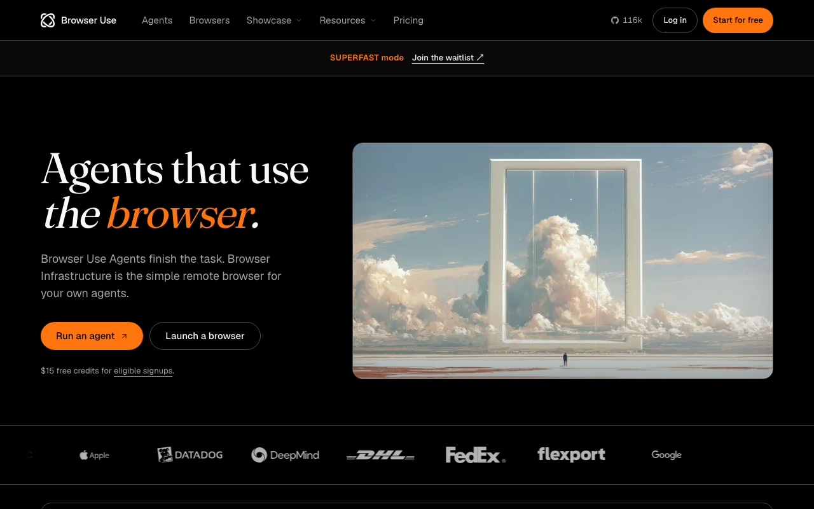

# Browser Use

> Agent 生态里事实上的标配执行器。

## 工具简介

Browser Use 是开源 AI 浏览器代理的现象级项目（11 万+ star）——思路一句话，**把浏览器整个交给大模型指挥**：自然语言下任务，它自己看页面、自己规划、自己点。

Python 库几行代码起一个自然语言 agent，模型不挑（OpenAI、Claude、开源模型都能接），自带视觉能力看得懂页面截图。测试、抓取、重复性网页操作通吃，生态最热闹（命令行、云服务、LangChain 集成都现成），做 agent 原型第一个试它。

## 基本信息

| 项目 | 信息 |
| --- | --- |
| 适用端 | Web |
| 出品方 | Browser Use（社区） |
| 工具形态 | Python AI 浏览器代理 |
| 官网 | <https://browser-use.com> |
| 项目地址 | <https://github.com/browser-use/browser-use>（117k+ star） |
| 开源协议 | MIT |
| 收费模式 | 开源免费（云服务商业） |

## 收录信息

- 收录自「测试开发技术」公众号文章《2026 年 UI 自动化工具大全，20 款主流工具一次看懂》《Web 自动化测试全景图：20 个主流 AI 自动化工具如何选？》（两篇均收录）
- GitHub 数据核验于 2026-10
- [返回 UI 自动化工具清单](./README.md)
