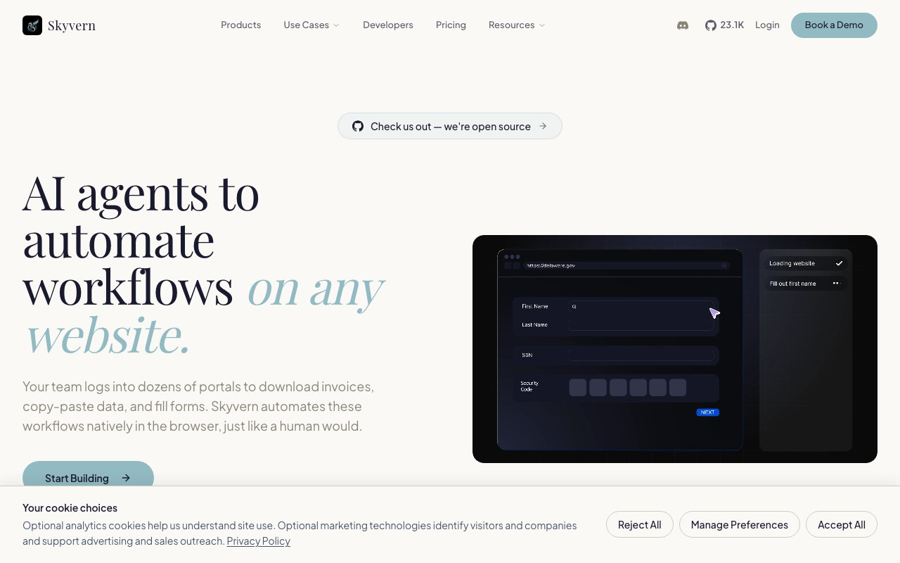

# Skyvern

> 别的工具读 DOM，它直接看截图交给视觉模型。

## 工具简介

Skyvern 是视觉加 LLM 的工作流自动化——把表单填写、数据搬运、跨站操作这类重复网页活整条交给它，页面长得再乱也不影响，**它看的是画面不是标签**。内容画在 canvas 里的内部老系统、没人维护的遗留页面，它反而最能对付。

每一步操作和截图都记下来，任务跑完能完整回放，人工审核有据可查；任务还能编排成工作流（登录、填表、下载串成一条链）。注意 **AGPL-3.0 协议，商用要掂量**。

## 基本信息

| 项目 | 信息 |
| --- | --- |
| 适用端 | Web |
| 出品方 | Skyvern AI |
| 工具形态 | 视觉 LLM 工作流自动化 |
| 官网 | <https://skyvern.com> |
| 项目地址 | <https://github.com/Skyvern-AI/skyvern>（23k+ star） |
| 开源协议 | AGPL-3.0（商用需评估） |
| 收费模式 | 开源可自部署 + 云服务商业 |

## 收录信息

- 收录自「测试开发技术」公众号文章《2026 年 UI 自动化工具大全，20 款主流工具一次看懂》《Web 自动化测试全景图：20 个主流 AI 自动化工具如何选？》（两篇均收录）
- GitHub 数据核验于 2026-10
- [返回 UI 自动化工具清单](./README.md)
