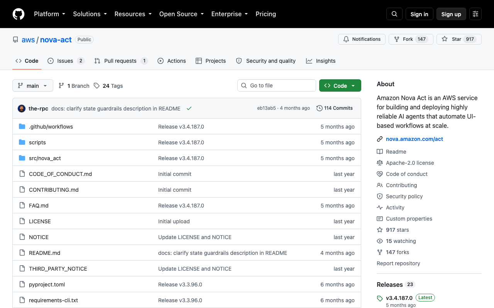

# Nova Act（亚马逊）

> 官方示例直接演示 agent 调 IAM 管 S3。

## 工具简介

Nova Act 是亚马逊官方的浏览器 Agent SDK，Python 写的，底下包着 Playwright，深度绑定 AWS 生态——账号、权限、存储这些周边对 AWS 团队全是现成的。

它主打可靠：官方说法是**模型会对每步动作自评再执行**，长链条任务不容易跑偏。

## 基本信息

| 项目 | 信息 |
| --- | --- |
| 适用端 | Web |
| 出品方 | 亚马逊（AWS） |
| 工具形态 | Python SDK（Playwright 封装） |
| 官网 | <https://nova.amazon.com/act> |
| 项目地址 | <https://github.com/aws/nova-act> |
| 开源协议 | Apache-2.0 |
| 收费模式 | 开源免费（模型按 Bedrock 计费） |

## 收录信息

- 收录自「测试开发技术」公众号文章《Web 自动化测试全景图：20 个主流 AI 自动化工具如何选？》
- GitHub 数据核验于 2026-10
- [返回 UI 自动化工具清单](./README.md)
