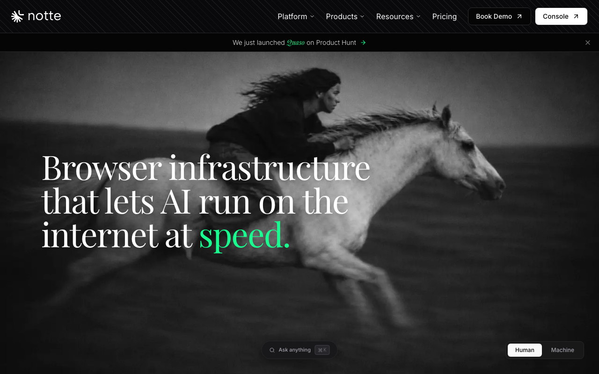

# Notte

> 长任务跑下来，token 账单和响应速度两头都占便宜。

## 工具简介

Notte 在浏览器和模型之间加了一层感知层——把整页 DOM **压缩成摘要**再喂给模型，同样的任务 token 开销小一截。

会话跑在云端，起一个浏览器几秒就绪，配了隐身和验证码处理，登录类站点也能对付（底层用的是 Playwright 的隐身分支）。适合已经跑通流程、被 token 成本烫到的团队。

## 基本信息

| 项目 | 信息 |
| --- | --- |
| 适用端 | Web |
| 出品方 | Nottelabs |
| 工具形态 | 感知层 + 云浏览器会话 |
| 官网 | <https://notte.cc> |
| 项目地址 | <https://github.com/nottelabs/notte>（source-available） |
| 开源协议 | 源码可用（非 OSI） |
| 收费模式 | 云服务订阅 |

## 收录信息

- 收录自「测试开发技术」公众号文章《Web 自动化测试全景图：20 个主流 AI 自动化工具如何选？》
- GitHub 数据核验于 2026-10
- [返回 UI 自动化工具清单](./README.md)
