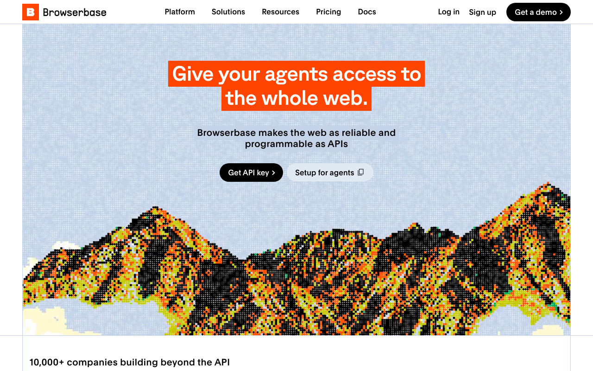

# Browserbase

> 几百个 agent 并发跑采集或操作任务的团队，就是给它准备的。

## 工具简介

Browserbase 是 Stagehand 母公司出品的云浏览器服务，官网写着支持**一万以上并发会话**，API 起一个会话只要几行代码。

会话相互隔离，每个 agent 一个干净环境，自带代理和隐身处理，封 IP 的风险低，还能录像回放，出问题不用猜。自己机房养浏览器集群是最重的一种活，这类云服务把浏览器做成了基础设施。

## 基本信息

| 项目 | 信息 |
| --- | --- |
| 适用端 | Web（云浏览器） |
| 出品方 | Browserbase |
| 工具形态 | 云浏览器服务 |
| 官网 | <https://www.browserbase.com> |
| 项目地址 | 闭源（SDK 开源） |
| 收费模式 | 按用量订阅 |

## 收录信息

- 收录自「测试开发技术」公众号文章《Web 自动化测试全景图：20 个主流 AI 自动化工具如何选？》
- [返回 UI 自动化工具清单](./README.md)
