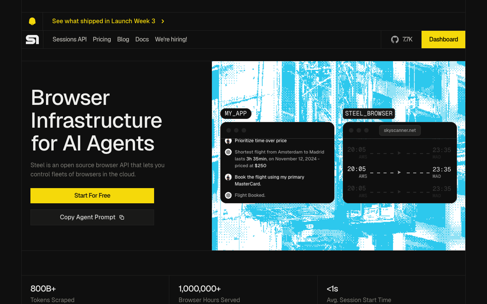

# Steel

> 合规要求高、数据不能出公司的团队，这一层里最值得看它。

## 工具简介

Steel 是给 Agent 和 App 的浏览器沙箱——整套开源（Apache-2.0），**既能用官方云，也能整套部署到自己机器上**，数据不出门。

会话即起即用，断线能重连，日志和截图齐全，排错省事。自托管一套 Docker 就能跑在自己服务器上，是云浏览器这一类里唯一「开源可自托管」的主流选项。

## 基本信息

| 项目 | 信息 |
| --- | --- |
| 适用端 | Web（云浏览器） |
| 出品方 | Steel |
| 工具形态 | 浏览器云（可自托管） |
| 官网 | <https://steel.dev> |
| 项目地址 | <https://github.com/steel-dev/steel-browser>（7.7k+ star） |
| 开源协议 | Apache-2.0 |
| 收费模式 | 开源可自部署 + 官方云订阅 |

## 收录信息

- 收录自「测试开发技术」公众号文章《Web 自动化测试全景图：20 个主流 AI 自动化工具如何选？》
- GitHub 数据核验于 2026-10
- [返回 UI 自动化工具清单](./README.md)
