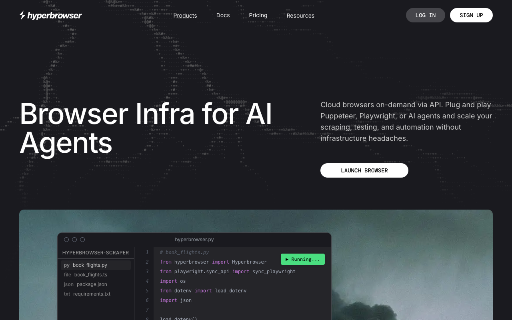

# Hyperbrowser

> 官网一句话定位：Browser Infra for AI Agents。

## 工具简介

Hyperbrowser 是 API 随取随用的云端浏览器——Puppeteer、Playwright 脚本直接接上去就能跑，验证码处理和隐身会话都提前配好，不用自己碰基础设施。

简单需求还有现成的抓取接口和 MCP 端点，一个请求进去页面数据直接返回，接进 Claude 这类客户端也顺。想把 agent 任务快速跑起来的团队从它上手很快。

## 基本信息

| 项目 | 信息 |
| --- | --- |
| 适用端 | Web（云浏览器） |
| 出品方 | Hyperbrowser |
| 工具形态 | 云浏览器服务 |
| 官网 | <https://hyperbrowser.ai> |
| 项目地址 | 闭源 |
| 收费模式 | 按用量订阅 |

## 收录信息

- 收录自「测试开发技术」公众号文章《Web 自动化测试全景图：20 个主流 AI 自动化工具如何选？》
- [返回 UI 自动化工具清单](./README.md)
