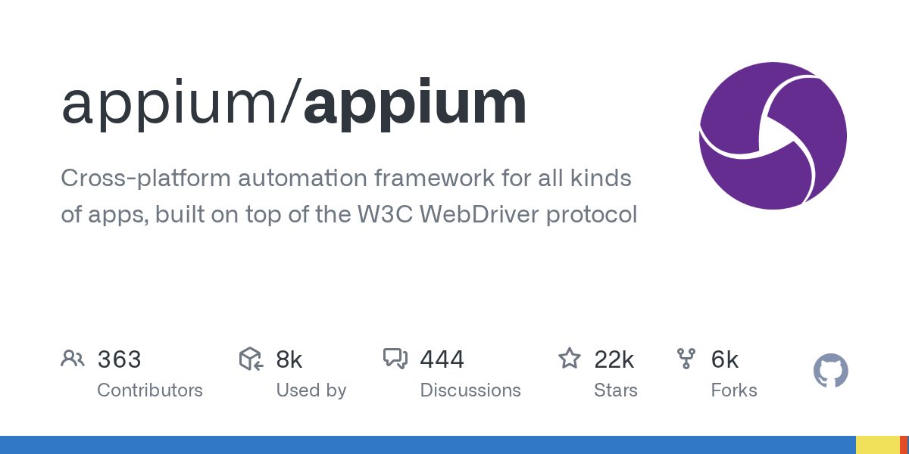

# Appium

> 移动 App 自动化的第一站，事实标准。

## 工具简介

Appium 是移动端自动化的开源事实标准——用 WebDriver 协议驱动 iOS 和 Android 原生、混合、移动 Web 应用，「一套 API 两个平台」。

它不重新发明轮子：各平台官方框架（iOS 的 XCUITest、Android 的 UiAutomator）在底层执行，Appium 在上面统一协议和多语言绑定（Java、Python、JS 都顺）。生态里派生出 Appium 2.x 插件体系、Appium Inspector 元素检查等配套。对测试团队，App 自动化选型从它开始不会错。

## 基本信息

| 项目 | 信息 |
| --- | --- |
| 适用端 | APP（iOS / Android，含混合与移动 Web） |
| 出品方 | Appium（开源社区） |
| 工具形态 | 自动化框架（多语言绑定） |
| 官网 | <https://appium.io/> |
| 项目地址 | <https://github.com/appium/appium>（22k+ star） |
| 开源协议 | Apache-2.0 |
| 收费模式 | 开源免费 |

## 收录信息

- 检索补充收录（2026-10），GitHub 数据核验于 2026-10
- [返回 UI 自动化工具清单](./README.md)
