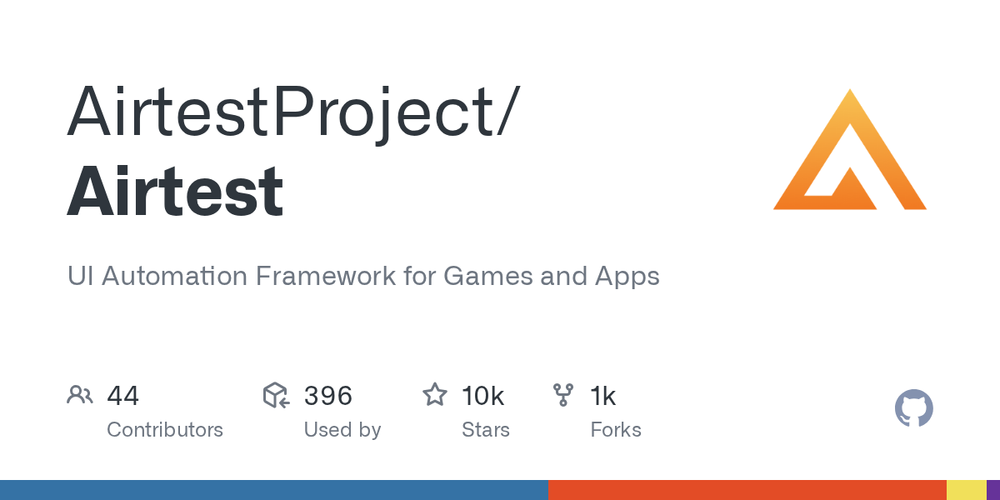

# Airtest

> 游戏测试首选，图像识别是它的立身之本。

## 工具简介

Airtest 是网易开源的跨平台 UI 自动化框架——**图像识别 + UI 控制双引擎**，App（Android/iOS）、Windows 桌面、小游戏、小程序都能跑。

游戏没有 DOM、控件树全靠渲染引擎画出来，传统控件定位失效——Airtest 靠截图找图的方式恰好对症，加上配套的 Poco 引擎（支持 Unity、Cocos 等引擎的 UI 树识别），成了游戏行业自动化测试的事实标准之一。配套 AirtestIDE 提供录制、报告、设备管理。

## 基本信息

| 项目 | 信息 |
| --- | --- |
| 适用端 | APP（游戏优先）+ 桌面（Windows） |
| 出品方 | 网易游戏 |
| 工具形态 | 自动化框架（Python）+ IDE |
| 官网 | <https://airtest.netease.com/> |
| 项目地址 | <https://github.com/AirtestProject/Airtest>（9.5k+ star） |
| 开源协议 | Apache-2.0 |
| 收费模式 | 开源免费 |

## 收录信息

- 检索补充收录（2026-10），GitHub 数据核验于 2026-10
- [返回 UI 自动化工具清单](./README.md)
