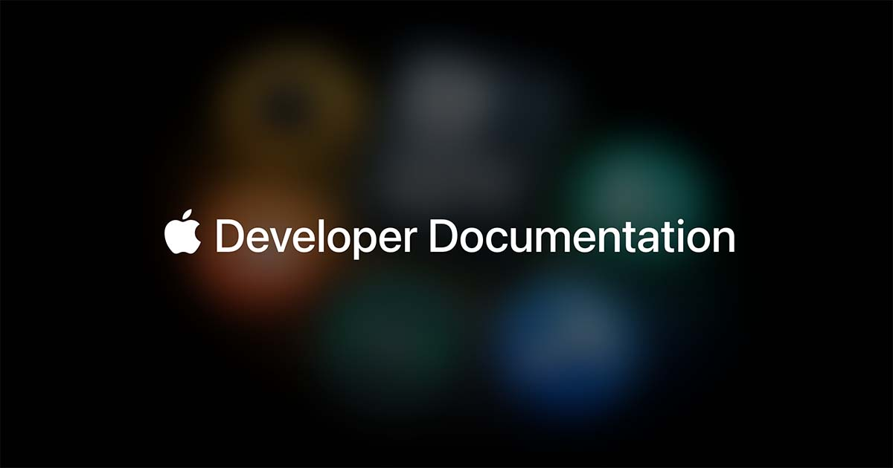

# XCUITest

> Apple 官方，iOS UI 测试的底层引擎。

## 工具简介

XCUITest 是 Apple 官方的 iOS UI 测试框架，XCTest 体系的一员——Xcode 原生集成，写完直接在模拟器和真机上跑，与 CI（Xcode Cloud、fastlane）无缝。

Appium 的 iOS 底层执行的也是它——直接用 XCUITest 意味着更少的封装层、更贴近系统的稳定性，代价是用 Swift/Objective-C 写用例。iOS 原生团队的开发自测和 Apple 平台官方链路，从它起步。

## 基本信息

| 项目 | 信息 |
| --- | --- |
| 适用端 | APP（iOS 官方） |
| 出品方 | Apple |
| 工具形态 | iOS UI 测试框架（Swift / ObjC） |
| 官网 | <https://developer.apple.com/documentation/xctest> |
| 项目地址 | 闭源（Apple 官方框架，随 Xcode 发布） |
| 收费模式 | 免费（随 Xcode） |

## 收录信息

- 检索补充收录（2026-10）
- [返回 UI 自动化工具清单](./README.md)
