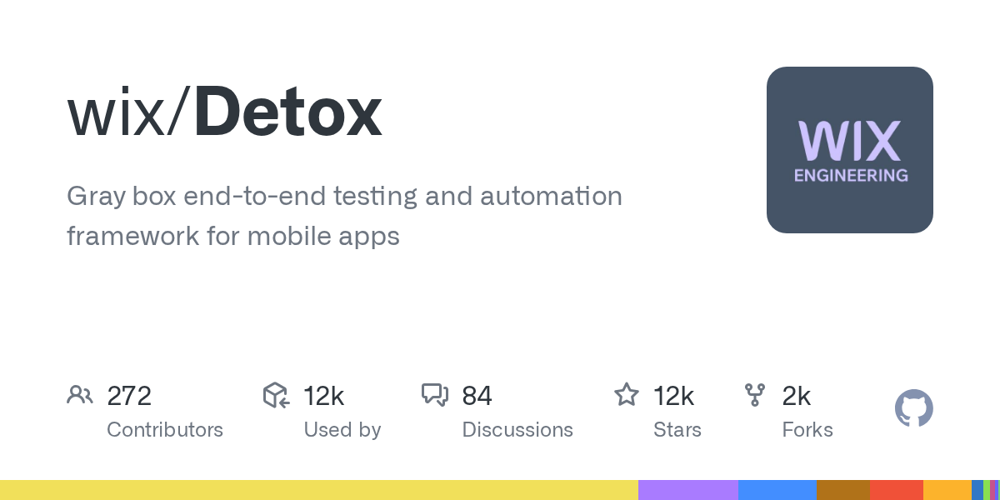

# Detox

> React Native 项目的默认答案，灰盒不 flaky。

## 工具简介

Detox 是 Wix 出品的 React Native / Expo 灰盒（gray-box）端到端测试框架——**跑在 App 进程内部**，能监听应用的空闲状态，操作与渲染同步等待，从根上减少 flaky。

对 RN 项目，它比 Appium 少一层跨进程封装、快且稳；与 Jest 集成写用例，Expo 官方也推荐。非 RN 的原生或混合项目，仍以 Appium 为主。

## 基本信息

| 项目 | 信息 |
| --- | --- |
| 适用端 | APP（React Native / Expo） |
| 出品方 | Wix |
| 工具形态 | 灰盒 E2E 测试框架（JS） |
| 官网 | <https://wix.github.io/Detox/> |
| 项目地址 | <https://github.com/wix/Detox>（12k+ star） |
| 开源协议 | MIT |
| 收费模式 | 开源免费 |

## 收录信息

- 检索补充收录（2026-10），GitHub 数据核验于 2026-10
- [返回 UI 自动化工具清单](./README.md)
