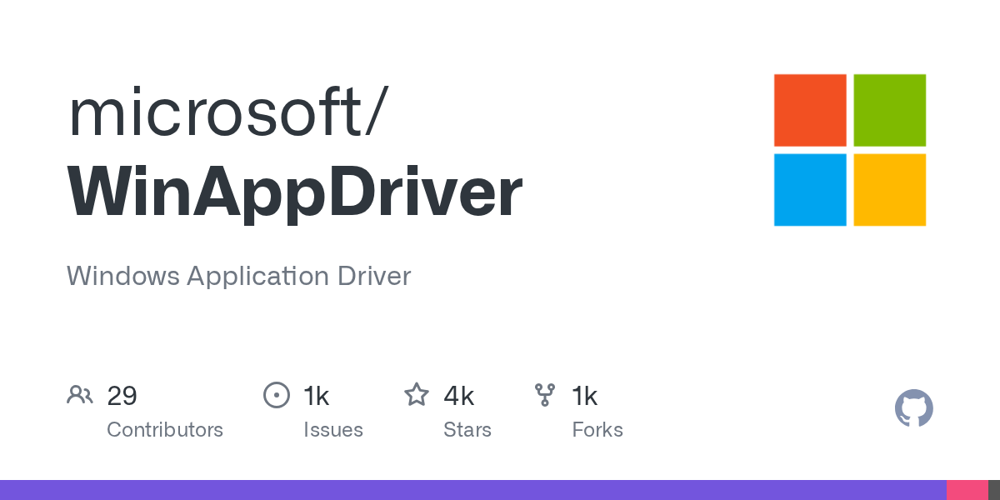

# WinAppDriver

> Windows 桌面自动化的官方底座，Selenium 一脉。

## 工具简介

WinAppDriver（Windows Application Driver）是微软官方的 Windows 应用自动化服务——用 **WebDriver/Selenium 协议**驱动 Win32、.NET、WPF、UWP 应用，会一门 Selenium 语言就能写 Windows 桌面自动化。

Appium 可以直接以它为底层驱动 Windows 应用（「Windows Driver」模式）。注意：驱动本体随官网发布（免费使用），GitHub 仓库放的是示例代码和 issue 跟踪。

## 基本信息

| 项目 | 信息 |
| --- | --- |
| 适用端 | 桌面（Windows） |
| 出品方 | 微软 |
| 工具形态 | 自动化服务（WebDriver 协议） |
| 官网 | <https://learn.microsoft.com/en-us/windows/win32/winappdriver/> |
| 项目地址 | <https://github.com/microsoft/WinAppDriver>（4k+ star，示例与 issue 跟踪；驱动本体免费闭源） |
| 开源协议 | 仓库 MIT（驱动本体免费使用） |
| 收费模式 | 免费 |

## 收录信息

- 检索补充收录（2026-10），GitHub 数据核验于 2026-10
- [返回 UI 自动化工具清单](./README.md)
