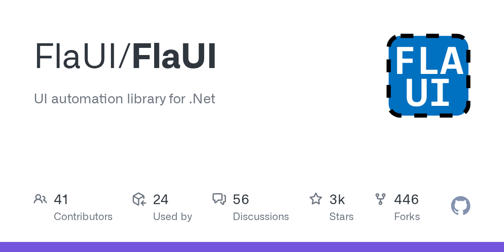

# FlaUI

> C# 团队的 Windows 桌面自动化主力。

## 工具简介

FlaUI 是 .NET 的 Windows 桌面自动化库，封装微软 UI Automation（UIA3）——Win32、WPF、WinForm、Store 应用全覆盖。

它是已停更的 TestStack.White 的社区继承者，API 现代、文档清晰；配套 FlaUInspect 工具检查元素。用 C# 写桌面自动化（尤其被测产品本身就是 .NET/WPF）的团队，它比跨语言方案更顺手。

## 基本信息

| 项目 | 信息 |
| --- | --- |
| 适用端 | 桌面（Windows / .NET） |
| 出品方 | FlaUI（社区） |
| 工具形态 | .NET 自动化库 |
| 官网 | <https://flaui.github.io/> |
| 项目地址 | <https://github.com/FlaUI/FlaUI>（3.1k+ star） |
| 开源协议 | MIT |
| 收费模式 | 开源免费 |

## 收录信息

- 检索补充收录（2026-10），GitHub 数据核验于 2026-10
- [返回 UI 自动化工具清单](./README.md)
