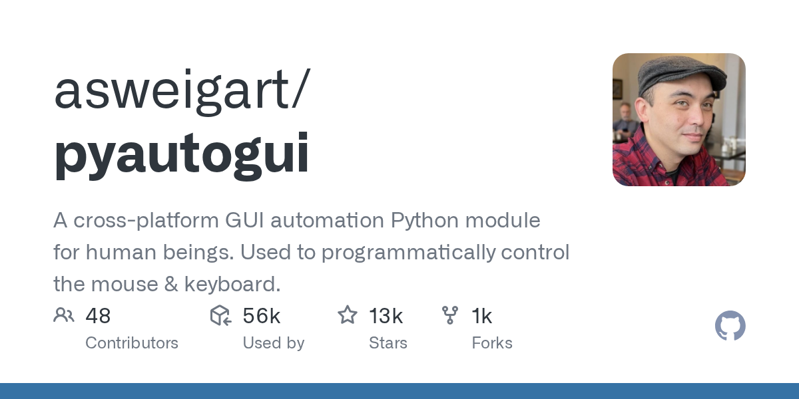

# PyAutoGUI

> 最简单直接的桌面自动化，Python 三行代码上手。

## 工具简介

PyAutoGUI 是跨平台（Windows/macOS/Linux）的 Python 桌面自动化库——控制鼠标键盘、截屏、图像识别定位（find 图在屏幕上的位置再点击）。

不依赖任何 UI 框架的辅助技术（UIA/Accessibility），看的是像素——优点是任何程序都能操作（包括游戏、远程桌面、虚拟机里的画面），缺点是分辨率和主题变了就失灵。轻量脚本、RPA 小活、无人值守操作用它最快；要稳定的控件级断言，配合 pywinauto 或 WinAppDriver。

## 基本信息

| 项目 | 信息 |
| --- | --- |
| 适用端 | 桌面（跨平台，图像识别） |
| 出品方 | Al Sweigart |
| 工具形态 | Python 桌面自动化库 |
| 官网 | <https://pyautogui.readthedocs.io/> |
| 项目地址 | <https://github.com/asweigart/pyautogui>（12k+ star） |
| 开源协议 | BSD-3-Clause |
| 收费模式 | 开源免费 |

## 收录信息

- 检索补充收录（2026-10），GitHub 数据核验于 2026-10
- [返回 UI 自动化工具清单](./README.md)
