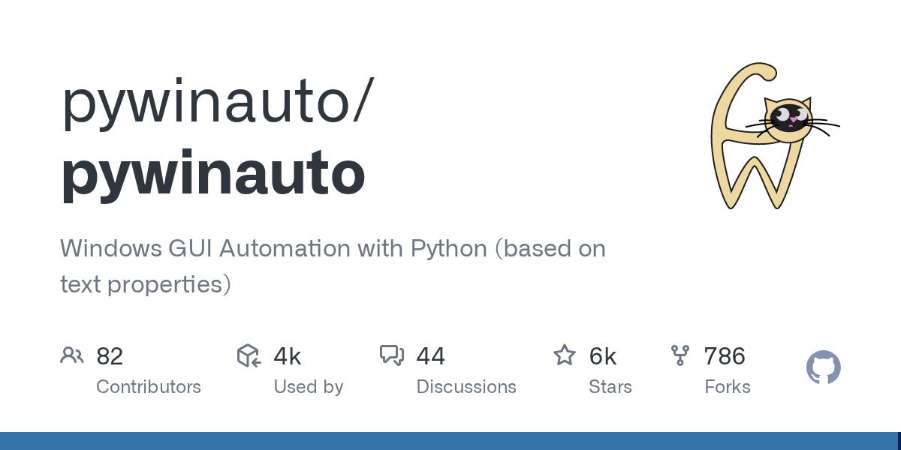

# pywinauto

> 控件级操作，比图像识别稳，Python 老牌。

## 工具简介

pywinauto 是 Python 的 Windows UI 自动化老牌库——支持 UIA 和 Win32 双后端，**控件级**的定位和操作（比 PyAutoGUI 的图像识别稳定得多），能拿到控件的属性做断言。

Windows 桌面产品的自动化测试（ERP 客户端、工业软件、安装程序）里它用得很多；录制工具 SWAPY 和文档配套齐全。局限：仅 Windows 平台。

## 基本信息

| 项目 | 信息 |
| --- | --- |
| 适用端 | 桌面（Windows / Python） |
| 出品方 | pywinauto（社区） |
| 工具形态 | Python Windows 自动化库 |
| 官网 | <https://pywinauto.readthedocs.io/> |
| 项目地址 | <https://github.com/pywinauto/pywinauto>（6.2k+ star） |
| 开源协议 | BSD-3-Clause |
| 收费模式 | 开源免费 |

## 收录信息

- 检索补充收录（2026-10），GitHub 数据核验于 2026-10
- [返回 UI 自动化工具清单](./README.md)
